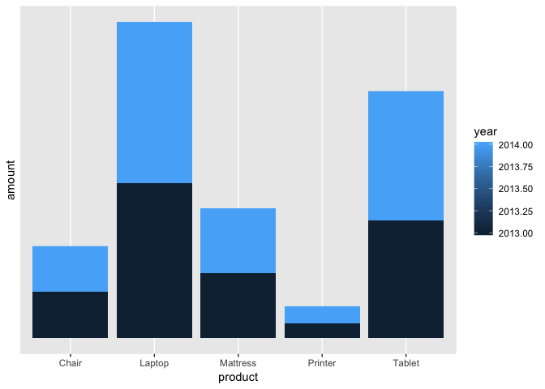
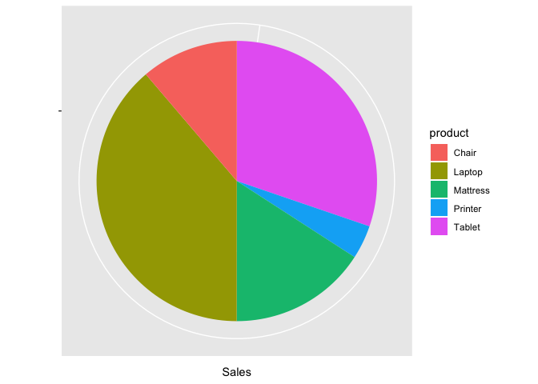

## 1.

 

a. If the term occurs in only one document, then it will have maximum weight.  
   If the term occurs in ever document, then it will have zero weight.
   
b. The purpose of this transformation is that the terms that occur in every document has no much significance to differentiate one document from another.

## 2. 

#### Setting up the Libraries and data

```r
library(readxl)
library(ggplot2)
library(dplyr)
Sales <- read_excel("Sales.xlsx")
```

### a. Sales by year and product in a stacked graph


```r
d1 <- Sales %>%
  select(year, category, product, amount) 

Sales_by_yr_product <- with(d1, d1[order(year),])

Q2a <- ggplot(data=Sales_by_yr_product, aes(x=product, y=amount, fill = year)) + geom_bar(stat="identity") +
  scale_y_continuous(breaks = 10^8)
```


```r
plot(Q2a)
```

<!-- -->

### b. Sales by product in a pie chart


```r
Sales_by_product <- Sales %>%
  group_by(product) %>%
  summarise(amount = sum(amount))

Q2b <- ggplot(Sales_by_product, aes(x="", y=amount, fill=product)) +
  geom_bar(width = 1, stat = "identity") + 
  scale_y_continuous(breaks=10^6) + 
  coord_polar("y", start=0) +
  labs(x="",y="Sales")
```


```r
plot(Q2b)
```

<!-- -->

### c. Avg. sales across the states in a bar graph


```r
avg_sales_state <- Sales %>%
  group_by(st) %>%
  arrange(country) %>%
  summarise(avg_sales = mean(amount))

Q2c <- ggplot(avg_sales_state, aes(x=st, y=avg_sales, fill=avg_sales)) + geom_col() + labs(x="State", y="Avg. Sales ($)")
```


```r
plot(Q2c)
```

<!-- -->


### d. Sales comparision between states in 2013 and 2014 using faceting


```r
d2 <- with(Sales, Sales[order(year, amount, state),])

Q2d <- ggplot(data=d2, aes(x=state, y=amount, fill=amount)) + 
  geom_bar(stat="identity") + 
  facet_grid(~year) +
  scale_y_continuous(breaks = 10^8)
```


```r
plot(Q2d)
```

<!-- -->


### e. 2013, 2014 month wise sales comparision - line graph


```r
d3 <- Sales %>%
  select(mo, year, amount) 

d4 <- d3 %>%
  group_by(mo, year) %>%
  arrange(mo) %>%
  summarise(sales = sum(amount))


Q2e <- ggplot(data = d4, aes(x = mo, y = sales, group = year, colour=year)) + 
  geom_line() +
  geom_point() +
  scale_x_discrete(breaks = Sales$month) + theme(legend.position = "right",
        legend.title = element_blank()) 
```


```r
plot(Q2e)
```

<!-- -->

## 3. Multidimensional Cube

#### Building the cube on Product, Month, Year and State:

```r
mul_cube <- tapply(Sales$amount, 
                       Sales[,c("product", "month", "year", "st")], 
                       FUN=function(x){return(sum(x))})
```


### 1. Slice operation: compute the revenue for Laptop during January of 2013 in each state.

```r
mul_cube ["Laptop", "Jan", "2013", ]
```

```
##     CA     NY     ON     QU     WA 
## 130000 153000  39000  62000  57000
```

### 2. Dice operation: compute the revenue for the furniture products (Mattress and Chair) during the second quarter (April, May and June) of 2014 in each state.


```r
mul_cube [c("Mattress","Chair"), 
             c("Apr","May","Jun"), 
             "2014", ]
```

```
## , , st = CA
## 
##           month
## product      Apr   May    Jun
##   Mattress 56000 60000 149600
##   Chair    56160 62640  57960
## 
## , , st = NY
## 
##           month
## product      Apr   May    Jun
##   Mattress 47200 15200 111200
##   Chair    56040 64320  43560
## 
## , , st = ON
## 
##           month
## product      Apr   May   Jun
##   Mattress    NA    NA    NA
##   Chair    21960 25200 15480
## 
## , , st = QU
## 
##           month
## product       Apr   May   Jun
##   Mattress 127200  2400 59200
##   Chair     25920 39480 18480
## 
## , , st = WA
## 
##           month
## product      Apr   May    Jun
##   Mattress    NA 51200 128800
##   Chair    29400 36960  12720
```

### 3. Rollup operation: compute the annual revenue for each product and collapse the state and month dimensions.


```r
apply(mul_cube, c("year", "product"),
      FUN=function(x) {return(sum(x, na.rm=TRUE))})
```

```
##       product
## year     Chair  Laptop Mattress Printer  Tablet
##   2013 2412240 8109000  3420000  786600 6158500
##   2014 2382960 8435000  3358400  872800 6751500
```

### 4. Drilldown operation: compute the annual and monthly revenue for each product and collapse the state dimension.


```r
apply(mul_cube, c("year", "month", "product"), 
      FUN=function(x) {return(sum(x, na.rm=TRUE))})
```

```
## , , product = Chair
## 
##       month
## year      Apr    Aug    Dec    Feb    Jan    Jul    Jun    Mar    May
##   2013 286320 125640 223920 159000 192960 204840 198720 237960 117120
##   2014 189480 204480 201120 201480 144720 237360 148200 247680 228600
##       month
## year      Nov    Oct    Sep
##   2013 137400 269160 259200
##   2014 174360 180960 224520
## 
## , , product = Laptop
## 
##       month
## year      Apr    Aug    Dec    Feb    Jan    Jul    Jun    Mar     May
##   2013 801000 895000 581000 558000 441000 614000 836000 622000 1087000
##   2014 648000 755000 623000 440000 638000 593000 896000 689000  581000
##       month
## year      Nov    Oct    Sep
##   2013 419000 827000 428000
##   2014 723000 892000 957000
## 
## , , product = Mattress
## 
##       month
## year      Apr    Aug    Dec    Feb    Jan    Jul    Jun    Mar    May
##   2013 280000 201600 374400 502400 443200 201600 148800 276800 425600
##   2014 230400 307200 243200 204800 312800 195200 448800 178400 128800
##       month
## year      Nov    Oct    Sep
##   2013 216800 212800 136000
##   2014 233600 490400 384800
## 
## , , product = Printer
## 
##       month
## year     Apr   Aug   Dec   Feb   Jan   Jul    Jun    Mar   May    Nov
##   2013 29600 67000 58200 93400 43400 35800  74800  71000 67600 100800
##   2014 30600 55400 83200 65400 61800 71600 119600 105600 91600  73200
##       month
## year      Oct   Sep
##   2013 127400 17600
##   2014  68000 46800
## 
## , , product = Tablet
## 
##       month
## year      Apr    Aug    Dec    Feb    Jan    Jul    Jun    Mar    May
##   2013 463500 455000 382500 414500 429500 720000 664500 492500 590500
##   2014 485000 481000 612500 448000 583500 564500 571500 571000 655000
##       month
## year      Nov    Oct    Sep
##   2013 595500 379000 571500
##   2014 701000 574500 504000
```
