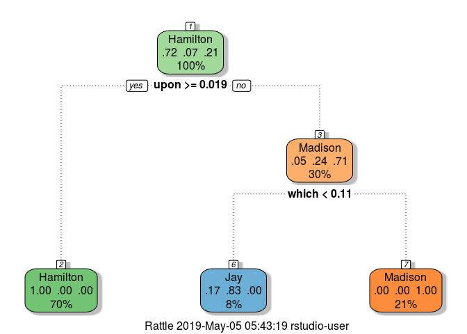

## Introduction: 
The Federalist Paper data set (Disputed_Essay_data.CSV) is provided. 
The features are a set of “function words”, for example, “upon”. The feature value is the percentage of the word occurrence in an essay. 
For example, for the essay “Hamilton_fed_31.txt”, if the function word “upon” appeared 3 times, and the total number of words in this essay is 1000,  the feature value is 3/1000=0.3%

## Objective: 
We would like to build a machine learning model that is able to predict the author for the disputed essays.

Dataset: Disputed_Essay_data.csv  
Model of choice: Decision Tree  
Metric to optimize: Gini  
Model selection criteria: Accuracy  


## Install packages 
  (if not already installed).


```r
#install.packages('rpart.plot')
#install.packages('dplyr', dependencies = TRUE)
#install.packages('caret', dependencies = TRUE)
#install.packages('rattle', dependencies = TRUE)
```

## Load Libraries


```r
library(rpart, warn.conflicts=F)
library(rpart.plot, warn.conflicts=F)
library(dplyr, warn.conflicts=F)
library(caret, warn.conflicts=F)
```

```
## Loading required package: lattice
```

```
## Loading required package: ggplot2
```

```r
library(rattle, warn.conflicts=F)
```

```
## Rattle: A free graphical interface for data science with R.
## Version 5.2.0 Copyright (c) 2006-2018 Togaware Pty Ltd.
## Type 'rattle()' to shake, rattle, and roll your data.
```

## Loading Data


```r
Disputed_Essay_data <- read.csv("Disputed_Essay_data.csv")

cat('Data Dimensions are: ')
```

```
## Data Dimensions are:
```

```r
dim(Disputed_Essay_data)
```

```
## [1] 85 72
```

### Let's see how the data looks like:


```r
head(Disputed_Essay_data) 
```

```
##   author         filename     a   all  also    an   and   any   are    as
## 1  dispt dispt_fed_49.txt 0.280 0.052 0.009 0.096 0.358 0.026 0.131 0.122
## 2  dispt dispt_fed_50.txt 0.177 0.063 0.013 0.038 0.393 0.063 0.051 0.139
## 3  dispt dispt_fed_51.txt 0.339 0.090 0.008 0.030 0.301 0.008 0.068 0.203
## 4  dispt dispt_fed_52.txt 0.270 0.024 0.016 0.024 0.262 0.056 0.064 0.111
## 5  dispt dispt_fed_53.txt 0.303 0.054 0.027 0.034 0.404 0.040 0.128 0.148
## 6  dispt dispt_fed_54.txt 0.245 0.059 0.007 0.067 0.282 0.052 0.111 0.252
##      at    be  been   but    by   can    do  down  even every  for.  from
## 1 0.017 0.411 0.026 0.009 0.140 0.035 0.026 0.000 0.009 0.044 0.096 0.044
## 2 0.114 0.393 0.165 0.000 0.139 0.000 0.013 0.000 0.025 0.000 0.076 0.101
## 3 0.023 0.474 0.015 0.038 0.173 0.023 0.000 0.008 0.015 0.023 0.098 0.053
## 4 0.056 0.365 0.127 0.032 0.167 0.056 0.000 0.000 0.024 0.040 0.103 0.079
## 5 0.013 0.344 0.047 0.061 0.209 0.088 0.000 0.000 0.020 0.027 0.141 0.074
## 6 0.015 0.297 0.030 0.037 0.186 0.000 0.000 0.007 0.007 0.007 0.067 0.096
##     had   has  have her   his   if.   in.  into    is    it   its   may
## 1 0.035 0.017 0.044   0 0.017 0.000 0.262 0.009 0.157 0.175 0.070 0.035
## 2 0.101 0.013 0.152   0 0.000 0.025 0.291 0.025 0.038 0.127 0.038 0.038
## 3 0.008 0.015 0.023   0 0.000 0.023 0.308 0.038 0.150 0.173 0.030 0.120
## 4 0.016 0.024 0.143   0 0.024 0.040 0.238 0.008 0.151 0.222 0.048 0.056
## 5 0.000 0.054 0.047   0 0.020 0.034 0.263 0.013 0.189 0.108 0.013 0.047
## 6 0.022 0.015 0.119   0 0.067 0.030 0.401 0.037 0.260 0.156 0.015 0.074
##    more  must my    no   not now    of    on   one  only    or   our shall
## 1 0.026 0.026  0 0.035 0.114   0 0.900 0.140 0.026 0.035 0.096 0.017 0.017
## 2 0.000 0.013  0 0.000 0.127   0 0.747 0.139 0.025 0.000 0.114 0.000 0.000
## 3 0.038 0.083  0 0.030 0.068   0 0.858 0.150 0.030 0.023 0.060 0.000 0.008
## 4 0.056 0.071  0 0.032 0.087   0 0.802 0.143 0.032 0.048 0.064 0.016 0.016
## 5 0.067 0.013  0 0.047 0.128   0 0.869 0.054 0.047 0.027 0.081 0.027 0.000
## 6 0.045 0.015  0 0.059 0.134   0 0.876 0.141 0.052 0.022 0.074 0.030 0.015
##   should    so  some  such  than  that   the their  then there things
## 1  0.017 0.035 0.009 0.026 0.009 0.184 1.425 0.114 0.000 0.009  0.009
## 2  0.013 0.013 0.063 0.000 0.000 0.152 1.254 0.165 0.000 0.000  0.000
## 3  0.068 0.038 0.030 0.045 0.023 0.188 1.490 0.053 0.015 0.015  0.000
## 4  0.032 0.040 0.024 0.008 0.000 0.238 1.326 0.071 0.008 0.000  0.000
## 5  0.000 0.027 0.067 0.027 0.047 0.162 1.193 0.027 0.007 0.007  0.000
## 6  0.030 0.007 0.045 0.015 0.030 0.208 1.469 0.089 0.007 0.007  0.000
##    this    to up  upon   was  were  what  when which   who  will  with
## 1 0.044 0.507  0 0.000 0.009 0.017 0.000 0.009 0.175 0.044 0.009 0.087
## 2 0.051 0.355  0 0.013 0.051 0.000 0.000 0.000 0.114 0.038 0.089 0.063
## 3 0.075 0.361  0 0.000 0.008 0.015 0.008 0.000 0.105 0.008 0.173 0.045
## 4 0.103 0.532  0 0.000 0.087 0.079 0.008 0.024 0.167 0.000 0.079 0.079
## 5 0.094 0.485  0 0.000 0.027 0.020 0.020 0.007 0.155 0.027 0.168 0.074
## 6 0.126 0.445  0 0.000 0.007 0.030 0.015 0.037 0.186 0.045 0.111 0.089
##   would your
## 1 0.192    0
## 2 0.139    0
## 3 0.068    0
## 4 0.064    0
## 5 0.040    0
## 6 0.037    0
```


```r
table(Disputed_Essay_data$author)
```

```
## 
##    dispt Hamilton       HM      Jay  Madison 
##       11       51        3        5       15
```

```r
cat('Summary of the data:')
```

```
## Summary of the data:
```

```r
summary(Disputed_Essay_data)
```

```
##       author               filename        a               all         
##  dispt   :11   dispt_fed_49.txt: 1   Min.   :0.0960   Min.   :0.01500  
##  Hamilton:51   dispt_fed_50.txt: 1   1st Qu.:0.2400   1st Qu.:0.03500  
##  HM      : 3   dispt_fed_51.txt: 1   Median :0.2990   Median :0.05000  
##  Jay     : 5   dispt_fed_52.txt: 1   Mean   :0.2932   Mean   :0.05284  
##  Madison :15   dispt_fed_53.txt: 1   3rd Qu.:0.3490   3rd Qu.:0.06600  
##                dispt_fed_54.txt: 1   Max.   :0.4660   Max.   :0.12700  
##                (Other)         :79                                     
##       also                an               and              any         
##  Min.   :0.000000   Min.   :0.00900   Min.   :0.2170   Min.   :0.00000  
##  1st Qu.:0.000000   1st Qu.:0.04900   1st Qu.:0.3190   1st Qu.:0.02500  
##  Median :0.007000   Median :0.07100   Median :0.3580   Median :0.04300  
##  Mean   :0.007659   Mean   :0.06839   Mean   :0.3846   Mean   :0.04161  
##  3rd Qu.:0.013000   3rd Qu.:0.08500   3rd Qu.:0.4130   3rd Qu.:0.05600  
##  Max.   :0.047000   Max.   :0.17900   Max.   :0.8210   Max.   :0.11400  
##                                                                         
##       are                as               at                be        
##  Min.   :0.01300   Min.   :0.0270   Min.   :0.00000   Min.   :0.0400  
##  1st Qu.:0.05100   1st Qu.:0.1000   1st Qu.:0.02600   1st Qu.:0.2580  
##  Median :0.06800   Median :0.1240   Median :0.03800   Median :0.3070  
##  Mean   :0.07707   Mean   :0.1242   Mean   :0.04427   Mean   :0.3012  
##  3rd Qu.:0.10200   3rd Qu.:0.1440   3rd Qu.:0.06300   3rd Qu.:0.3580  
##  Max.   :0.16300   Max.   :0.2520   Max.   :0.11800   Max.   :0.4810  
##                                                                       
##       been              but                by              can         
##  Min.   :0.00000   Min.   :0.00000   Min.   :0.0270   Min.   :0.00000  
##  1st Qu.:0.03000   1st Qu.:0.02200   1st Qu.:0.0920   1st Qu.:0.01400  
##  Median :0.05300   Median :0.03200   Median :0.1240   Median :0.02900  
##  Mean   :0.05967   Mean   :0.03232   Mean   :0.1272   Mean   :0.03558  
##  3rd Qu.:0.08400   3rd Qu.:0.04200   3rd Qu.:0.1620   3rd Qu.:0.05200  
##  Max.   :0.16500   Max.   :0.08900   Max.   :0.2640   Max.   :0.11000  
##                                                                        
##        do                down               even            every        
##  Min.   :0.000000   Min.   :0.000000   Min.   :0.0000   Min.   :0.00000  
##  1st Qu.:0.000000   1st Qu.:0.000000   1st Qu.:0.0000   1st Qu.:0.00900  
##  Median :0.006000   Median :0.000000   Median :0.0100   Median :0.02200  
##  Mean   :0.006259   Mean   :0.001529   Mean   :0.0114   Mean   :0.02391  
##  3rd Qu.:0.010000   3rd Qu.:0.000000   3rd Qu.:0.0180   3rd Qu.:0.03400  
##  Max.   :0.028000   Max.   :0.017000   Max.   :0.0370   Max.   :0.08700  
##                                                                          
##       for.              from              had               has         
##  Min.   :0.03000   Min.   :0.02600   Min.   :0.00000   Min.   :0.00000  
##  1st Qu.:0.07000   1st Qu.:0.05700   1st Qu.:0.00800   1st Qu.:0.02500  
##  Median :0.08800   Median :0.07800   Median :0.01600   Median :0.04600  
##  Mean   :0.09376   Mean   :0.07978   Mean   :0.02116   Mean   :0.04442  
##  3rd Qu.:0.11400   3rd Qu.:0.09800   3rd Qu.:0.02700   3rd Qu.:0.05700  
##  Max.   :0.21300   Max.   :0.16200   Max.   :0.14100   Max.   :0.11400  
##                                                                         
##       have              her                his               if.         
##  Min.   :0.01100   Min.   :0.000000   Min.   :0.00000   Min.   :0.00000  
##  1st Qu.:0.07300   1st Qu.:0.000000   1st Qu.:0.00000   1st Qu.:0.01600  
##  Median :0.09000   Median :0.000000   Median :0.01400   Median :0.02600  
##  Mean   :0.09474   Mean   :0.008094   Mean   :0.02862   Mean   :0.02733  
##  3rd Qu.:0.12400   3rd Qu.:0.007000   3rd Qu.:0.03900   3rd Qu.:0.03400  
##  Max.   :0.18500   Max.   :0.150000   Max.   :0.24700   Max.   :0.09900  
##                                                                          
##       in.              into               is               it        
##  Min.   :0.1890   Min.   :0.00000   Min.   :0.0280   Min.   :0.0750  
##  1st Qu.:0.2670   1st Qu.:0.01000   1st Qu.:0.1180   1st Qu.:0.1290  
##  Median :0.3040   Median :0.02200   Median :0.1510   Median :0.1510  
##  Mean   :0.3174   Mean   :0.02409   Mean   :0.1563   Mean   :0.1567  
##  3rd Qu.:0.3550   3rd Qu.:0.03400   3rd Qu.:0.1960   3rd Qu.:0.1900  
##  Max.   :0.4990   Max.   :0.10500   Max.   :0.3230   Max.   :0.2840  
##                                                                      
##       its               may               more              must        
##  Min.   :0.00000   Min.   :0.00000   Min.   :0.00000   Min.   :0.00000  
##  1st Qu.:0.03000   1st Qu.:0.03600   1st Qu.:0.02300   1st Qu.:0.01400  
##  Median :0.04200   Median :0.05600   Median :0.04400   Median :0.02700  
##  Mean   :0.04836   Mean   :0.06181   Mean   :0.04561   Mean   :0.03305  
##  3rd Qu.:0.06400   3rd Qu.:0.08500   3rd Qu.:0.06100   3rd Qu.:0.04400  
##  Max.   :0.15000   Max.   :0.13400   Max.   :0.13000   Max.   :0.11100  
##                                                                         
##        my                 no               not               now          
##  Min.   :0.000000   Min.   :0.00000   Min.   :0.02000   Min.   :0.000000  
##  1st Qu.:0.000000   1st Qu.:0.02000   1st Qu.:0.07500   1st Qu.:0.000000  
##  Median :0.000000   Median :0.02900   Median :0.09500   Median :0.005000  
##  Mean   :0.003259   Mean   :0.03236   Mean   :0.09248   Mean   :0.006035  
##  3rd Qu.:0.005000   3rd Qu.:0.04300   3rd Qu.:0.11200   3rd Qu.:0.010000  
##  Max.   :0.056000   Max.   :0.08300   Max.   :0.14800   Max.   :0.026000  
##                                                                           
##        of               on               one               only        
##  Min.   :0.5620   Min.   :0.00000   Min.   :0.00500   Min.   :0.00000  
##  1st Qu.:0.8560   1st Qu.:0.04300   1st Qu.:0.02700   1st Qu.:0.01000  
##  Median :0.9020   Median :0.06200   Median :0.03600   Median :0.02200  
##  Mean   :0.9094   Mean   :0.06926   Mean   :0.04079   Mean   :0.02288  
##  3rd Qu.:0.9690   3rd Qu.:0.09700   3rd Qu.:0.05000   3rd Qu.:0.03400  
##  Max.   :1.2110   Max.   :0.15600   Max.   :0.13500   Max.   :0.06500  
##                                                                        
##        or               our            shall             should       
##  Min.   :0.02700   Min.   :0.000   Min.   :0.00000   Min.   :0.00000  
##  1st Qu.:0.07000   1st Qu.:0.000   1st Qu.:0.00600   1st Qu.:0.01000  
##  Median :0.08100   Median :0.013   Median :0.01400   Median :0.02700  
##  Mean   :0.09674   Mean   :0.023   Mean   :0.01875   Mean   :0.02656  
##  3rd Qu.:0.11600   3rd Qu.:0.028   3rd Qu.:0.02700   3rd Qu.:0.03800  
##  Max.   :0.32100   Max.   :0.199   Max.   :0.07900   Max.   :0.09100  
##                                                                       
##        so               some              such              than        
##  Min.   :0.00000   Min.   :0.00000   Min.   :0.00000   Min.   :0.00000  
##  1st Qu.:0.01800   1st Qu.:0.00900   1st Qu.:0.01800   1st Qu.:0.02700  
##  Median :0.02900   Median :0.01700   Median :0.02900   Median :0.04300  
##  Mean   :0.02982   Mean   :0.01989   Mean   :0.02922   Mean   :0.04396  
##  3rd Qu.:0.04000   3rd Qu.:0.02800   3rd Qu.:0.03800   3rd Qu.:0.05500  
##  Max.   :0.07200   Max.   :0.06700   Max.   :0.08500   Max.   :0.15000  
##                                                                         
##       that            the            their              then         
##  Min.   :0.081   Min.   :0.669   Min.   :0.00500   Min.   :0.000000  
##  1st Qu.:0.171   1st Qu.:1.178   1st Qu.:0.05500   1st Qu.:0.000000  
##  Median :0.208   Median :1.275   Median :0.08600   Median :0.006000  
##  Mean   :0.212   Mean   :1.281   Mean   :0.08553   Mean   :0.006082  
##  3rd Qu.:0.244   3rd Qu.:1.423   3rd Qu.:0.10600   3rd Qu.:0.010000  
##  Max.   :0.380   Max.   :1.803   Max.   :0.18300   Max.   :0.021000  
##                                                                      
##      there             things              this               to        
##  Min.   :0.00000   Min.   :0.000000   Min.   :0.00900   Min.   :0.3330  
##  1st Qu.:0.00900   1st Qu.:0.000000   1st Qu.:0.06900   1st Qu.:0.4690  
##  Median :0.02200   Median :0.000000   Median :0.09000   Median :0.5400  
##  Mean   :0.02638   Mean   :0.002659   Mean   :0.08701   Mean   :0.5358  
##  3rd Qu.:0.03900   3rd Qu.:0.006000   3rd Qu.:0.10500   3rd Qu.:0.6060  
##  Max.   :0.10500   Max.   :0.015000   Max.   :0.15300   Max.   :0.7760  
##                                                                         
##        up                upon              was               were        
##  Min.   :0.000000   Min.   :0.00000   Min.   :0.00000   Min.   :0.00000  
##  1st Qu.:0.000000   1st Qu.:0.00000   1st Qu.:0.00900   1st Qu.:0.00700  
##  Median :0.000000   Median :0.02800   Median :0.01500   Median :0.01500  
##  Mean   :0.003482   Mean   :0.02922   Mean   :0.02584   Mean   :0.02022  
##  3rd Qu.:0.006000   3rd Qu.:0.05000   3rd Qu.:0.03200   3rd Qu.:0.02900  
##  Max.   :0.032000   Max.   :0.10200   Max.   :0.18900   Max.   :0.10800  
##                                                                          
##       what              when             which             who         
##  Min.   :0.00000   Min.   :0.00000   Min.   :0.0810   Min.   :0.00000  
##  1st Qu.:0.00500   1st Qu.:0.00000   1st Qu.:0.1180   1st Qu.:0.01600  
##  Median :0.01000   Median :0.00900   Median :0.1520   Median :0.02700  
##  Mean   :0.01286   Mean   :0.01174   Mean   :0.1578   Mean   :0.03253  
##  3rd Qu.:0.02000   3rd Qu.:0.01500   3rd Qu.:0.1830   3rd Qu.:0.04400  
##  Max.   :0.06000   Max.   :0.07300   Max.   :0.2760   Max.   :0.12900  
##                                                                        
##       will              with             would             your         
##  Min.   :0.00600   Min.   :0.02700   Min.   :0.0090   Min.   :0.000000  
##  1st Qu.:0.05200   1st Qu.:0.06100   1st Qu.:0.0420   1st Qu.:0.000000  
##  Median :0.08100   Median :0.07900   Median :0.0780   Median :0.000000  
##  Mean   :0.09865   Mean   :0.07968   Mean   :0.1017   Mean   :0.002024  
##  3rd Qu.:0.13500   3rd Qu.:0.09200   3rd Qu.:0.1470   3rd Qu.:0.000000  
##  Max.   :0.34000   Max.   :0.15000   Max.   :0.3820   Max.   :0.074000  
## 
```

From above, we can see that there is class imbalance in the dataset. We will have to program our model to learn this skewed distribution in the data. 

Baseline_model can be a model that always predicts Hamilton. This model will have a performance of *71.83%* accuracy (Trained over 51 + 5 + 15 records; i.e. all records for each author exlcuding mixed authors)


### Preprocessing the data

```r
filter_auths <- c("dispt", "HM")    

non_dispute_data <- select(Disputed_Essay_data, -one_of("filename")) %>%
  filter(!author %in% filter_auths) %>%
  droplevels()

dispute_data <- select(Disputed_Essay_data, -one_of("filename")) %>%
  filter(author=="dispt")%>%
  droplevels()

cat('Authors in Non-dispute data:')
```

```
## Authors in Non-dispute data:
```

```r
table(non_dispute_data$author)
```

```
## 
## Hamilton      Jay  Madison 
##       51        5       15
```

### Lets split the non dispute data for training and testing
We train on the train dataset and keep the test dataset to evaluate the performance of our model or select the model towards the very end. We choose train and test as 60% and 40% of entire dataset.


```r
sample_size <- floor(0.60 * nrow(non_dispute_data))
set.seed(123)
train_ind <- sample(seq_len(nrow(non_dispute_data)), size = sample_size)

train_dataset <- non_dispute_data[train_ind, ]
test_dataset <- non_dispute_data[-train_ind, ]
```

### Building the decision tree model using cross validation 


```r
tr_control <- trainControl(method = "cv", number = 3)

dt_model_cv <- train(author ~.,
                 data = non_dispute_data,
                 method = "rpart",
                 metric = "Accuracy",
                 control = rpart.control(minsplit = 10, maxdepth = 3, cp = 0.07),
                 trControl = tr_control)
```

### Plotting the Model


```r
fancyRpartPlot(dt_model_cv$finalModel)
```

<!-- -->

### Test the model


```r
predict_model <- predict(dt_model_cv, test_dataset, type="raw")
confusionMatrix(table(test_dataset[,1], predict_model))
```

```
## Confusion Matrix and Statistics
## 
##           predict_model
##            Hamilton Jay Madison
##   Hamilton       19   1       0
##   Jay             0   3       0
##   Madison         0   0       6
## 
## Overall Statistics
##                                           
##                Accuracy : 0.9655          
##                  95% CI : (0.8224, 0.9991)
##     No Information Rate : 0.6552          
##     P-Value [Acc > NIR] : 7.683e-05       
##                                           
##                   Kappa : 0.9298          
##                                           
##  Mcnemar's Test P-Value : NA              
## 
## Statistics by Class:
## 
##                      Class: Hamilton Class: Jay Class: Madison
## Sensitivity                   1.0000     0.7500         1.0000
## Specificity                   0.9000     1.0000         1.0000
## Pos Pred Value                0.9500     1.0000         1.0000
## Neg Pred Value                1.0000     0.9615         1.0000
## Prevalence                    0.6552     0.1379         0.2069
## Detection Rate                0.6552     0.1034         0.2069
## Detection Prevalence          0.6897     0.1034         0.2069
## Balanced Accuracy             0.9500     0.8750         1.0000
```

### Predicting the Disputed Authors


```r
predict_model <- predict(dt_model_cv, dispute_data, type="raw")
table(dispute_data[,1], predict_model)
```

```
##        predict_model
##         Hamilton Jay Madison
##   dispt        0   1      10
```


### Conclusion

With the model build, the model predicted that all the disputed essays are written by *Madison*.

### References

1. Treating class imabalance in decision tree
2. Caret documentation
3. Rpart documentation
4. dplyr documentation
5. Caret documentation
