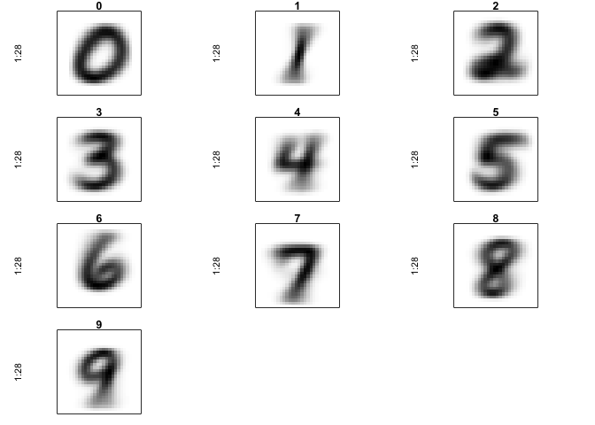
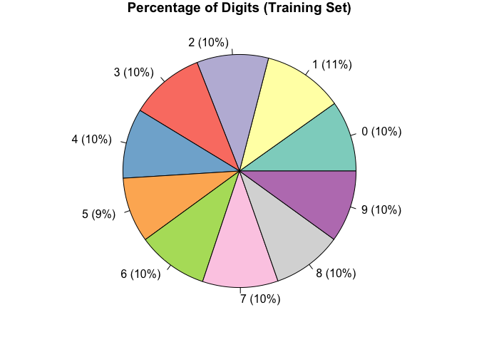
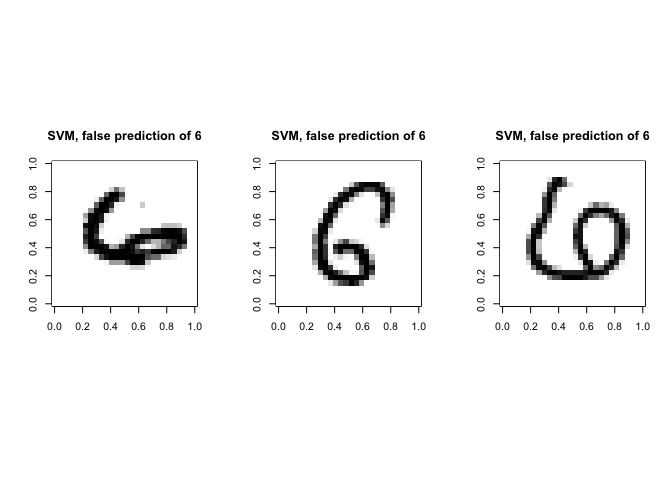
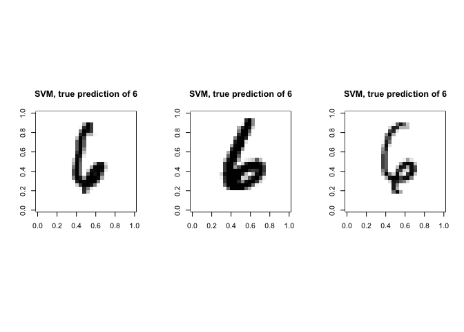
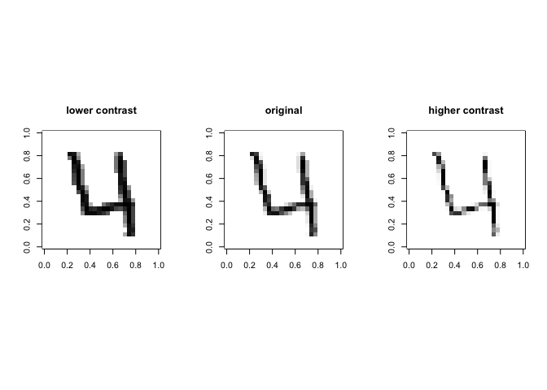
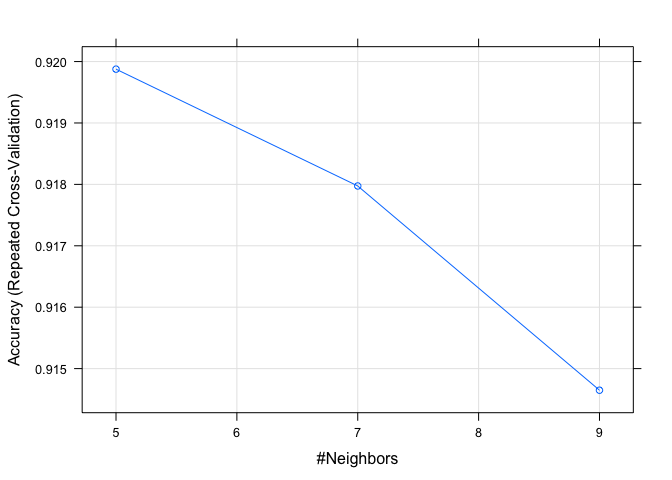

### Introduction
The goal is to recognize digits 0 to 9 in handwriting images. This is a classification problem and applied three different algorithms to predict the MNIST handwritten digit database - SVM, naïve Bayes and kNN algorithms.

**Data Sources**  
Original data file: https://www.dropbox.com/s/npxk66fxruv09u5/Kaggle-digit-train.csv?dl=0  
Original test data (51MB)   https://www.dropbox.com/s/3wnkss7x6m4pqgx/Kaggle-digit-test.csv?dl=0  

**Sample data files**  
small sample of training data (1.5MB): CSV:   https://www.dropbox.com/s/v7dncz0mqklayus/Kaggle-digit-train-sample-small-1400.csv?dl=0  
small sample of test data (1000 examples): CSV:   https://www.dropbox.com/s/e5tokwdmkd8ggmm/Kaggle-digit-test-sample1000.csv?dl=0  


### Objective
We would like to build models using naïve Bayes, SVM and kNN algorithms to recognize digits 0 to 9 in handwriting images and provide the better model for this task.

### Install Required packages

```r
#install.packages("caret")
#install.packages("RColorBrewer")
#install.packages("e1071")
#install.packages("FNN")
#install.packages("klaR")
#install.packages("kernlab")
#install.packages("naivebayes")
```

### Load required Libraries

```r
library(readr)
library(caret)
```

```
## Loading required package: lattice
```

```
## Loading required package: ggplot2
```

```
## Registered S3 methods overwritten by 'ggplot2':
##   method         from 
##   [.quosures     rlang
##   c.quosures     rlang
##   print.quosures rlang
```

```r
library(RColorBrewer)
library(e1071)
library(FNN)
library(klaR)
```

```
## Loading required package: MASS
```

```r
library(kernlab)
```

```
## 
## Attaching package: 'kernlab'
```

```
## The following object is masked from 'package:ggplot2':
## 
##     alpha
```

```r
library(naivebayes)
```

### Loading the dataset

```r
#train <- read_csv("Kaggle-digit-train-sample-small-1400.csv")
#test <- read_csv("Kaggle-digit-test-sample1000.csv")

train <- read_csv("Kaggle-digit-train.csv")
```

```
## Parsed with column specification:
## cols(
##   .default = col_double()
## )
```

```
## See spec(...) for full column specifications.
```

```r
test <- read_csv("Kaggle-digit-test.csv")
```

```
## Parsed with column specification:
## cols(
##   .default = col_double(),
##   label = col_character()
## )
## See spec(...) for full column specifications.
```

```r
#Lets see the data
dim(train); dim(test)
```

```
## [1] 42000   785
```

```
## [1] 28000   785
```

```r
head(train); head(test)
```

```
## # A tibble: 6 x 785
##   label pixel0 pixel1 pixel2 pixel3 pixel4 pixel5 pixel6 pixel7 pixel8
##   <dbl>  <dbl>  <dbl>  <dbl>  <dbl>  <dbl>  <dbl>  <dbl>  <dbl>  <dbl>
## 1     1      0      0      0      0      0      0      0      0      0
## 2     0      0      0      0      0      0      0      0      0      0
## 3     1      0      0      0      0      0      0      0      0      0
## 4     4      0      0      0      0      0      0      0      0      0
## 5     0      0      0      0      0      0      0      0      0      0
## 6     0      0      0      0      0      0      0      0      0      0
## # … with 775 more variables: pixel9 <dbl>, pixel10 <dbl>, pixel11 <dbl>,
## #   pixel12 <dbl>, pixel13 <dbl>, pixel14 <dbl>, pixel15 <dbl>,
## #   pixel16 <dbl>, pixel17 <dbl>, pixel18 <dbl>, pixel19 <dbl>,
## #   pixel20 <dbl>, pixel21 <dbl>, pixel22 <dbl>, pixel23 <dbl>,
## #   pixel24 <dbl>, pixel25 <dbl>, pixel26 <dbl>, pixel27 <dbl>,
## #   pixel28 <dbl>, pixel29 <dbl>, pixel30 <dbl>, pixel31 <dbl>,
## #   pixel32 <dbl>, pixel33 <dbl>, pixel34 <dbl>, pixel35 <dbl>,
## #   pixel36 <dbl>, pixel37 <dbl>, pixel38 <dbl>, pixel39 <dbl>,
## #   pixel40 <dbl>, pixel41 <dbl>, pixel42 <dbl>, pixel43 <dbl>,
## #   pixel44 <dbl>, pixel45 <dbl>, pixel46 <dbl>, pixel47 <dbl>,
## #   pixel48 <dbl>, pixel49 <dbl>, pixel50 <dbl>, pixel51 <dbl>,
## #   pixel52 <dbl>, pixel53 <dbl>, pixel54 <dbl>, pixel55 <dbl>,
## #   pixel56 <dbl>, pixel57 <dbl>, pixel58 <dbl>, pixel59 <dbl>,
## #   pixel60 <dbl>, pixel61 <dbl>, pixel62 <dbl>, pixel63 <dbl>,
## #   pixel64 <dbl>, pixel65 <dbl>, pixel66 <dbl>, pixel67 <dbl>,
## #   pixel68 <dbl>, pixel69 <dbl>, pixel70 <dbl>, pixel71 <dbl>,
## #   pixel72 <dbl>, pixel73 <dbl>, pixel74 <dbl>, pixel75 <dbl>,
## #   pixel76 <dbl>, pixel77 <dbl>, pixel78 <dbl>, pixel79 <dbl>,
## #   pixel80 <dbl>, pixel81 <dbl>, pixel82 <dbl>, pixel83 <dbl>,
## #   pixel84 <dbl>, pixel85 <dbl>, pixel86 <dbl>, pixel87 <dbl>,
## #   pixel88 <dbl>, pixel89 <dbl>, pixel90 <dbl>, pixel91 <dbl>,
## #   pixel92 <dbl>, pixel93 <dbl>, pixel94 <dbl>, pixel95 <dbl>,
## #   pixel96 <dbl>, pixel97 <dbl>, pixel98 <dbl>, pixel99 <dbl>,
## #   pixel100 <dbl>, pixel101 <dbl>, pixel102 <dbl>, pixel103 <dbl>,
## #   pixel104 <dbl>, pixel105 <dbl>, pixel106 <dbl>, pixel107 <dbl>,
## #   pixel108 <dbl>, …
```

```
## # A tibble: 6 x 785
##   label pixel0 pixel1 pixel2 pixel3 pixel4 pixel5 pixel6 pixel7 pixel8
##   <chr>  <dbl>  <dbl>  <dbl>  <dbl>  <dbl>  <dbl>  <dbl>  <dbl>  <dbl>
## 1 ?          0      0      0      0      0      0      0      0      0
## 2 ?          0      0      0      0      0      0      0      0      0
## 3 ?          0      0      0      0      0      0      0      0      0
## 4 ?          0      0      0      0      0      0      0      0      0
## 5 ?          0      0      0      0      0      0      0      0      0
## 6 ?          0      0      0      0      0      0      0      0      0
## # … with 775 more variables: pixel9 <dbl>, pixel10 <dbl>, pixel11 <dbl>,
## #   pixel12 <dbl>, pixel13 <dbl>, pixel14 <dbl>, pixel15 <dbl>,
## #   pixel16 <dbl>, pixel17 <dbl>, pixel18 <dbl>, pixel19 <dbl>,
## #   pixel20 <dbl>, pixel21 <dbl>, pixel22 <dbl>, pixel23 <dbl>,
## #   pixel24 <dbl>, pixel25 <dbl>, pixel26 <dbl>, pixel27 <dbl>,
## #   pixel28 <dbl>, pixel29 <dbl>, pixel30 <dbl>, pixel31 <dbl>,
## #   pixel32 <dbl>, pixel33 <dbl>, pixel34 <dbl>, pixel35 <dbl>,
## #   pixel36 <dbl>, pixel37 <dbl>, pixel38 <dbl>, pixel39 <dbl>,
## #   pixel40 <dbl>, pixel41 <dbl>, pixel42 <dbl>, pixel43 <dbl>,
## #   pixel44 <dbl>, pixel45 <dbl>, pixel46 <dbl>, pixel47 <dbl>,
## #   pixel48 <dbl>, pixel49 <dbl>, pixel50 <dbl>, pixel51 <dbl>,
## #   pixel52 <dbl>, pixel53 <dbl>, pixel54 <dbl>, pixel55 <dbl>,
## #   pixel56 <dbl>, pixel57 <dbl>, pixel58 <dbl>, pixel59 <dbl>,
## #   pixel60 <dbl>, pixel61 <dbl>, pixel62 <dbl>, pixel63 <dbl>,
## #   pixel64 <dbl>, pixel65 <dbl>, pixel66 <dbl>, pixel67 <dbl>,
## #   pixel68 <dbl>, pixel69 <dbl>, pixel70 <dbl>, pixel71 <dbl>,
## #   pixel72 <dbl>, pixel73 <dbl>, pixel74 <dbl>, pixel75 <dbl>,
## #   pixel76 <dbl>, pixel77 <dbl>, pixel78 <dbl>, pixel79 <dbl>,
## #   pixel80 <dbl>, pixel81 <dbl>, pixel82 <dbl>, pixel83 <dbl>,
## #   pixel84 <dbl>, pixel85 <dbl>, pixel86 <dbl>, pixel87 <dbl>,
## #   pixel88 <dbl>, pixel89 <dbl>, pixel90 <dbl>, pixel91 <dbl>,
## #   pixel92 <dbl>, pixel93 <dbl>, pixel94 <dbl>, pixel95 <dbl>,
## #   pixel96 <dbl>, pixel97 <dbl>, pixel98 <dbl>, pixel99 <dbl>,
## #   pixel100 <dbl>, pixel101 <dbl>, pixel102 <dbl>, pixel103 <dbl>,
## #   pixel104 <dbl>, pixel105 <dbl>, pixel106 <dbl>, pixel107 <dbl>,
## #   pixel108 <dbl>, …
```

### Data Cleansing

```r
#Converting the "label" attribute to factor, is the digit that was drawn by the user. The rest of the columns contain the pixel-values of the associated image.
train[, 1] <- as.factor(train[, 1]$label)  # As Category

#All the other columns are numeric:
head(sapply(train[1,], class))
```

```
##     label    pixel0    pixel1    pixel2    pixel3    pixel4 
##  "factor" "numeric" "numeric" "numeric" "numeric" "numeric"
```

```r
#Some columns contain zero for all observations or they have near zero variance. Lets remove these columns:

train_orig <- train
test_orig <- test
nzv.data <- nearZeroVar(train, saveMetrics = TRUE)
drop.cols <- rownames(nzv.data)[nzv.data$nzv == TRUE]
train <- train[,!names(train) %in% drop.cols]
test <- test[,!names(test) %in% drop.cols]
```

### Data Analysis

```r
# Now, let’s do some exploratory data analysis. Reference(1).

BNW <- c("white", "black")
CUSTOM_BNW <- colorRampPalette(colors = BNW)

par(mfrow = c(4, 3), pty = "s", mar = c(1, 1, 1, 1), xaxt = "n", yaxt = "n")
images_digits_0_9 <- array(dim = c(10, 28 * 28))
for (digit in 0:9) {
  images_digits_0_9[digit + 1, ] <- apply(train_orig[train_orig[, 1] == digit, -1], 2, sum)
  images_digits_0_9[digit + 1, ] <- images_digits_0_9[digit + 1, ]/max(images_digits_0_9[digit + 1, ]) * 255
  z <- array(images_digits_0_9[digit + 1, ], dim = c(28, 28))
  z <- z[, 28:1]
  image(1:28, 1:28, z, main = digit, col = CUSTOM_BNW(256))
}

# More blurriness, more chance of misprediction. For example, 0 has a smooth and fully dark line but see how blurry is 9 or 4 or even 1. That means there is a higher chance of incorrect prediction of such numbers. We will explore this more in detail when we predict our validation data set. What is the proportion of each digit in the train set?

CUSTOM_BNW_PLOT <- colorRampPalette(brewer.pal(10, "Set3"))
LabTable <- table(train_orig$label)
par(mfrow = c(1, 1))
```

<!-- -->

```r
percentage <- round(LabTable/sum(LabTable) * 100)
labels <- paste0(row.names(LabTable), " (", percentage, "%) ")
pie(LabTable, labels = labels, col = CUSTOM_BNW_PLOT(10), main = "Percentage of Digits (Training Set)")
```

<!-- -->


```r
# So, all digits contribute almost equally to the data set implying that the train set is appropriately randomly selected. 

set.seed(12340)
trainIndex <- createDataPartition(train$label, p = 0.1, list = FALSE, times = 1)
allindices <- c(1:42000)
training <- train[trainIndex,]

validating <- train[-trainIndex,]
vali0_index <- allindices[! allindices %in% trainIndex]
validIndex <- createDataPartition(validating$label, p = 0.11, list = FALSE, times = 1)
validating <- validating[validIndex,]
original_validindex <- vali0_index[validIndex]
```

### Building the model using Naïve Bayes Algorithm

```r
#Lets build the model using Naïve Bayes
model.naiveBayes <- naive_bayes(training$label ~., data = training)
summary(model.naiveBayes)
```

```
##           Length Class  Mode     
## data        2    -none- list     
## levels     10    -none- character
## laplace     1    -none- numeric  
## tables    252    -none- list     
## prior      10    table  numeric  
## usekernel   1    -none- logical  
## call        3    -none- call
```

```r
prediction.naiveBayes <- predict(model.naiveBayes, newdata = validating, type = "class")
confusionMatrix(factor(prediction.naiveBayes), factor(validating$label))
```

```
## Confusion Matrix and Statistics
## 
##           Reference
## Prediction   0   1   2   3   4   5   6   7   8   9
##          0 384   0   2   3   0  10   1   4   0   3
##          1   1 441   8  12   2   6   7  14  31   5
##          2   7   8 324  24   8  12  11  10   7   4
##          3   1   1   3 308   0  32   0   1   7   2
##          4   0   0   9   0 299   2   4   6   3  31
##          5   9   4   2  35   2 276   5   1  21   4
##          6   2   7  39  12  11  15 376   0   8   7
##          7   0   0   2   5   2   4   0 369   0  15
##          8   4   3  25  24   8   8   6   5 310   6
##          9   1   0   0   8  72  11   0  26  16 338
## 
## Overall Statistics
##                                          
##                Accuracy : 0.8229         
##                  95% CI : (0.811, 0.8344)
##     No Information Rate : 0.1115         
##     P-Value [Acc > NIR] : < 2.2e-16      
##                                          
##                   Kappa : 0.8032         
##                                          
##  Mcnemar's Test P-Value : NA             
## 
## Statistics by Class:
## 
##                      Class: 0 Class: 1 Class: 2 Class: 3 Class: 4 Class: 5
## Sensitivity           0.93888   0.9504  0.78261   0.7146  0.74010  0.73404
## Specificity           0.99387   0.9767  0.97572   0.9874  0.98536  0.97808
## Pos Pred Value        0.94349   0.8368  0.78072   0.8676  0.84463  0.76880
## Neg Pred Value        0.99334   0.9937  0.97598   0.9677  0.97243  0.97370
## Prevalence            0.09827   0.1115  0.09947   0.1036  0.09707  0.09034
## Detection Rate        0.09226   0.1060  0.07785   0.0740  0.07184  0.06631
## Detection Prevalence  0.09779   0.1266  0.09971   0.0853  0.08506  0.08626
## Balanced Accuracy     0.96637   0.9636  0.87916   0.8510  0.86273  0.85606
##                      Class: 6 Class: 7 Class: 8 Class: 9
## Sensitivity           0.91707  0.84633  0.76923  0.81446
## Specificity           0.97308  0.99249  0.97632  0.96424
## Pos Pred Value        0.78826  0.92947  0.77694  0.71610
## Neg Pred Value        0.99077  0.98220  0.97529  0.97913
## Prevalence            0.09851  0.10476  0.09683  0.09971
## Detection Rate        0.09034  0.08866  0.07448  0.08121
## Detection Prevalence  0.11461  0.09539  0.09587  0.11341
## Balanced Accuracy     0.94508  0.91941  0.87278  0.88935
```


```r
#Train the model.
nbc <- trainControl(method = "cv", number = 4)
modnb <- train(label ~. , data = training, method = "nb", trControl = nbc)
```


```r
#Print model
modnb
```

```
## Naive Bayes 
## 
## 4206 samples
##  252 predictor
##   10 classes: '0', '1', '2', '3', '4', '5', '6', '7', '8', '9' 
## 
## No pre-processing
## Resampling: Cross-Validated (4 fold) 
## Summary of sample sizes: 3156, 3155, 3153, 3154 
## Resampling results across tuning parameters:
## 
##   usekernel  Accuracy   Kappa    
##   FALSE            NaN        NaN
##    TRUE      0.6918874  0.6567599
## 
## Tuning parameter 'fL' was held constant at a value of 0
## Tuning
##  parameter 'adjust' was held constant at a value of 1
## Accuracy was used to select the optimal model using the largest value.
## The final values used for the model were fL = 0, usekernel = TRUE
##  and adjust = 1.
```
We can see the model has predicted with an accuracy of ~81%.


### Building the model using SVM Algorithm

```r
#Train the model
tc <- trainControl(method = "cv", number = 4, verboseIter = F, allowParallel = T)
modSVMR1 <- train(label ~. , data= training, method = "svmRadial", trControl = tc)

SVMRadial_predict1 <- as.numeric(predict(modSVMR1,newdata = validating))-1
confusionMatrix(factor(SVMRadial_predict1), (validating$label))
```

```
## Confusion Matrix and Statistics
## 
##           Reference
## Prediction   0   1   2   3   4   5   6   7   8   9
##          0 403   0   2   0   0   1   3   2   1   1
##          1   0 456   3   2   1   1   1   3   5   0
##          2   2   5 383   9   3   3   4   0   2   2
##          3   0   0   3 384   0   6   1   0  12   2
##          4   0   0   6   0 387   0   1   3   3  18
##          5   4   1   2  18   0 359   2   2   5   3
##          6   0   1   7   3   2   4 398   0   2   0
##          7   0   0   3   5   2   0   0 415   3   9
##          8   0   1   3   6   0   2   0   1 364   0
##          9   0   0   2   4   9   0   0  10   6 380
## 
## Overall Statistics
##                                           
##                Accuracy : 0.944           
##                  95% CI : (0.9366, 0.9508)
##     No Information Rate : 0.1115          
##     P-Value [Acc > NIR] : < 2.2e-16       
##                                           
##                   Kappa : 0.9378          
##                                           
##  Mcnemar's Test P-Value : NA              
## 
## Statistics by Class:
## 
##                      Class: 0 Class: 1 Class: 2 Class: 3 Class: 4 Class: 5
## Sensitivity           0.98533   0.9828  0.92512  0.89095  0.95792  0.95479
## Specificity           0.99734   0.9957  0.99200  0.99357  0.99175  0.99023
## Pos Pred Value        0.97579   0.9661  0.92736  0.94118  0.92584  0.90657
## Neg Pred Value        0.99840   0.9978  0.99173  0.98748  0.99546  0.99549
## Prevalence            0.09827   0.1115  0.09947  0.10356  0.09707  0.09034
## Detection Rate        0.09683   0.1096  0.09202  0.09226  0.09298  0.08626
## Detection Prevalence  0.09923   0.1134  0.09923  0.09803  0.10043  0.09515
## Balanced Accuracy     0.99133   0.9892  0.95856  0.94226  0.97484  0.97251
##                      Class: 6 Class: 7 Class: 8 Class: 9
## Sensitivity           0.97073  0.95183  0.90323  0.91566
## Specificity           0.99494  0.99410  0.99654  0.99173
## Pos Pred Value        0.95444  0.94966  0.96552  0.92457
## Neg Pred Value        0.99680  0.99436  0.98970  0.99067
## Prevalence            0.09851  0.10476  0.09683  0.09971
## Detection Rate        0.09563  0.09971  0.08746  0.09130
## Detection Prevalence  0.10019  0.10500  0.09058  0.09875
## Balanced Accuracy     0.98283  0.97297  0.94988  0.95369
```

```r
SVM06 <- which(SVMRadial_predict1 != validating$label & validating$label == 6)
head(SVM06)
```

```
## [1]  254  354  660 1604 2027 2302
```


```r
# false prediction of 6

rotate <- function(x) t(apply(x, 2, rev))
par(mfrow = c(1, 3), pty ='s')
for (i06 in 1:3){
  m = rotate(matrix(unlist(train_orig[original_validindex[SVM06[i06]],-1]),ncol = 28,byrow = T))
  image(m,col=CUSTOM_BNW(255), main = "SVM, false prediction of 6")  
}
```

<!-- -->


```r
# correctly prediction of 6

SVM66 <- which(SVMRadial_predict1 == validating$label & validating$label == 6)
par(mfrow = c(1, 3), pty ='s')
for (i66 in 1:3){
  m = rotate(matrix(unlist(train_orig[original_validindex[SVM66[i66]],-1]),ncol = 28,byrow = T))
  image(m,col=CUSTOM_BNW(255), main = "SVM, true prediction of 6")  
}
```

<!-- -->


```r
# Lets alter the contrast of the image. If the darkness (or the value) of a cell is increased, it is more likely that the cell is detected by a classifier. That means we boost the weak features

power = 3
Contrast <- function (DATASET, POWER) {
  outDATASET <- cbind(DATASET$label, as.data.frame((DATASET[,-1]/255)^(POWER)*255))
  names(outDATASET)[1] <- "label"  
  outDATASET
}

train_orig_low_contrast <- Contrast(train_orig, 1/power) 
train_orig_high_contrast <- Contrast(train_orig, power) 

plotIndex = 4
par(mfrow = c(1, 3), pty ='s')
m = rotate(matrix(unlist(train_orig_low_contrast[plotIndex,-1]),ncol = 28,byrow = T))
image(m,col=CUSTOM_BNW(255), main = "lower contrast")
m = rotate(matrix(unlist(train_orig[plotIndex,-1]),ncol = 28,byrow = T))
image(m,col=CUSTOM_BNW(255), main = "original")
m = rotate(matrix(unlist(train_orig_high_contrast[plotIndex,-1]),ncol = 28,byrow = T))
image(m,col=CUSTOM_BNW(255), main = "higher contrast")
```

<!-- -->


```r
# Now, let’s repeat SVM training with the two new data sets and see if changing the contrast impacts SVM performance:

training2   <- Contrast(training, 1/power)
training3   <- Contrast(training,   power)
validating2 <- Contrast(validating, 1/power)
validating3 <- Contrast(validating, power)
modSVMR2 <- train(label ~. , data= training2, method = "svmRadial", trControl = tc)
SVMRadial_predict2 <- as.numeric(predict(modSVMR2,newdata = validating2))-1
confusionMatrix(factor(SVMRadial_predict2), factor(validating2$label))
```

```
## Confusion Matrix and Statistics
## 
##           Reference
## Prediction   0   1   2   3   4   5   6   7   8   9
##          0 404   0   2   1   0   1   3   2   1   1
##          1   0 452   1   2   2   1   1   2   6   0
##          2   1   7 392   8   3   0   2   1   1   2
##          3   0   0   1 388   0   8   1   0  13   3
##          4   0   1   4   1 384   0   1   2   3  18
##          5   3   1   1  13   0 359   3   1   2   2
##          6   0   1   6   3   3   4 399   0   3   0
##          7   0   0   4   5   2   0   0 419   2   9
##          8   1   2   2   6   1   2   0   0 366   0
##          9   0   0   1   4   9   1   0   9   6 380
## 
## Overall Statistics
##                                          
##                Accuracy : 0.9474         
##                  95% CI : (0.9402, 0.954)
##     No Information Rate : 0.1115         
##     P-Value [Acc > NIR] : < 2.2e-16      
##                                          
##                   Kappa : 0.9415         
##                                          
##  Mcnemar's Test P-Value : NA             
## 
## Statistics by Class:
## 
##                      Class: 0 Class: 1 Class: 2 Class: 3 Class: 4 Class: 5
## Sensitivity           0.98778   0.9741  0.94686  0.90023  0.95050  0.95479
## Specificity           0.99707   0.9959  0.99333  0.99303  0.99202  0.99313
## Pos Pred Value        0.97349   0.9679  0.94005  0.93720  0.92754  0.93247
## Neg Pred Value        0.99867   0.9968  0.99413  0.98853  0.99466  0.99550
## Prevalence            0.09827   0.1115  0.09947  0.10356  0.09707  0.09034
## Detection Rate        0.09707   0.1086  0.09419  0.09322  0.09226  0.08626
## Detection Prevalence  0.09971   0.1122  0.10019  0.09947  0.09947  0.09250
## Balanced Accuracy     0.99242   0.9850  0.97009  0.94663  0.97126  0.97396
##                      Class: 6 Class: 7 Class: 8 Class: 9
## Sensitivity           0.97317   0.9610  0.90819  0.91566
## Specificity           0.99467   0.9941  0.99628  0.99199
## Pos Pred Value        0.95227   0.9501  0.96316  0.92683
## Neg Pred Value        0.99706   0.9954  0.99022  0.99067
## Prevalence            0.09851   0.1048  0.09683  0.09971
## Detection Rate        0.09587   0.1007  0.08794  0.09130
## Detection Prevalence  0.10067   0.1060  0.09130  0.09851
## Balanced Accuracy     0.98392   0.9776  0.95223  0.95383
```

```r
modSVMR3 <- train(label ~. , data= training3, method = "svmRadial", trControl = tc)
SVMRadial_predict3 <- as.numeric(predict(modSVMR3,newdata = validating3))-1
confusionMatrix(factor(SVMRadial_predict3), factor(validating3$label))
```

```
## Confusion Matrix and Statistics
## 
##           Reference
## Prediction   0   1   2   3   4   5   6   7   8   9
##          0 396   0   3   0   0   4   5   1   1   2
##          1   0 455   3   1   0   2   1   4   6   1
##          2   4   3 375  10   6   4   7   0   2   1
##          3   1   0   3 383   0   8   2   1  15   2
##          4   0   0  10   1 382   0   2   4   4  18
##          5   6   0   3  20   2 350   5   5   8   4
##          6   2   2   9   4   3   4 388   0   4   0
##          7   0   0   3   4   2   1   0 411   3  10
##          8   0   3   3   6   1   2   0   0 354   0
##          9   0   1   2   2   8   1   0  10   6 377
## 
## Overall Statistics
##                                           
##                Accuracy : 0.9301          
##                  95% CI : (0.9219, 0.9376)
##     No Information Rate : 0.1115          
##     P-Value [Acc > NIR] : < 2.2e-16       
##                                           
##                   Kappa : 0.9223          
##                                           
##  Mcnemar's Test P-Value : NA              
## 
## Statistics by Class:
## 
##                      Class: 0 Class: 1 Class: 2 Class: 3 Class: 4 Class: 5
## Sensitivity           0.96822   0.9806  0.90580  0.88863  0.94554  0.93085
## Specificity           0.99574   0.9951  0.99013  0.99142  0.98962  0.98600
## Pos Pred Value        0.96117   0.9619  0.91019  0.92289  0.90736  0.86849
## Neg Pred Value        0.99653   0.9976  0.98960  0.98719  0.99412  0.99308
## Prevalence            0.09827   0.1115  0.09947  0.10356  0.09707  0.09034
## Detection Rate        0.09515   0.1093  0.09010  0.09202  0.09178  0.08409
## Detection Prevalence  0.09899   0.1136  0.09899  0.09971  0.10115  0.09683
## Balanced Accuracy     0.98198   0.9879  0.94796  0.94003  0.96758  0.95843
##                      Class: 6 Class: 7 Class: 8 Class: 9
## Sensitivity           0.94634  0.94266  0.87841  0.90843
## Specificity           0.99254  0.99383  0.99601  0.99199
## Pos Pred Value        0.93269  0.94700  0.95935  0.92629
## Neg Pred Value        0.99413  0.99329  0.98708  0.98988
## Prevalence            0.09851  0.10476  0.09683  0.09971
## Detection Rate        0.09322  0.09875  0.08506  0.09058
## Detection Prevalence  0.09995  0.10428  0.08866  0.09779
## Balanced Accuracy     0.96944  0.96824  0.93721  0.95021
```


```r
#Binding the training datasets and running the model again.
training4 <- rbind(training, training2, training3)
modSVMR4 <- train(label ~. , data= training4, method = "svmRadial", trControl = tc)
SVMRadial_predict4 <- as.numeric(predict(modSVMR4,newdata = validating2))-1
confusionMatrix(factor(SVMRadial_predict4), factor(validating2$label))
```

```
## Confusion Matrix and Statistics
## 
##           Reference
## Prediction   0   1   2   3   4   5   6   7   8   9
##          0 405   0   2   1   0   4   4   4   1   2
##          1   0 451   1   1   1   1   0   1   2   0
##          2   0   6 389   9   4   0   3   0   1   1
##          3   0   0   2 391   0   8   1   1  10   2
##          4   0   0   5   1 384   0   1   1   3  12
##          5   2   1   0  12   0 354   2   1   3   0
##          6   0   1   6   3   3   4 399   0   4   0
##          7   0   1   4   5   2   0   0 417   2   5
##          8   2   3   3   6   0   4   0   1 374   1
##          9   0   1   2   2  10   1   0  10   3 392
## 
## Overall Statistics
##                                           
##                Accuracy : 0.9505          
##                  95% CI : (0.9435, 0.9569)
##     No Information Rate : 0.1115          
##     P-Value [Acc > NIR] : < 2.2e-16       
##                                           
##                   Kappa : 0.945           
##                                           
##  Mcnemar's Test P-Value : NA              
## 
## Statistics by Class:
## 
##                      Class: 0 Class: 1 Class: 2 Class: 3 Class: 4 Class: 5
## Sensitivity           0.99022   0.9720  0.93961  0.90719  0.95050  0.94149
## Specificity           0.99520   0.9981  0.99360  0.99357  0.99388  0.99445
## Pos Pred Value        0.95745   0.9847  0.94189  0.94217  0.94349  0.94400
## Neg Pred Value        0.99893   0.9965  0.99333  0.98932  0.99467  0.99419
## Prevalence            0.09827   0.1115  0.09947  0.10356  0.09707  0.09034
## Detection Rate        0.09731   0.1084  0.09346  0.09395  0.09226  0.08506
## Detection Prevalence  0.10163   0.1100  0.09923  0.09971  0.09779  0.09010
## Balanced Accuracy     0.99271   0.9850  0.96661  0.95038  0.97219  0.96797
##                      Class: 6 Class: 7 Class: 8 Class: 9
## Sensitivity           0.97317   0.9564  0.92804  0.94458
## Specificity           0.99440   0.9949  0.99468  0.99226
## Pos Pred Value        0.95000   0.9564  0.94924  0.93112
## Neg Pred Value        0.99706   0.9949  0.99230  0.99385
## Prevalence            0.09851   0.1048  0.09683  0.09971
## Detection Rate        0.09587   0.1002  0.08986  0.09419
## Detection Prevalence  0.10091   0.1048  0.09467  0.10115
## Balanced Accuracy     0.98379   0.9757  0.96136  0.96842
```

About 95% is the accuracy we get by adding up “training2” (lower contrast) and “training3” (higher contrast) and original “training” set. 

### Building model with KNN Model


```r
#Train the model
ctrl <- trainControl(method="repeatedcv",repeats = 1, number = 4, verboseIter = T, allowParallel = T)
knnFit <- train(label ~ ., data = training, method = "knn", trControl = ctrl)
```

```
## + Fold1.Rep1: k=5 
## - Fold1.Rep1: k=5 
## + Fold1.Rep1: k=7 
## - Fold1.Rep1: k=7 
## + Fold1.Rep1: k=9 
## - Fold1.Rep1: k=9 
## + Fold2.Rep1: k=5 
## - Fold2.Rep1: k=5 
## + Fold2.Rep1: k=7 
## - Fold2.Rep1: k=7 
## + Fold2.Rep1: k=9 
## - Fold2.Rep1: k=9 
## + Fold3.Rep1: k=5 
## - Fold3.Rep1: k=5 
## + Fold3.Rep1: k=7 
## - Fold3.Rep1: k=7 
## + Fold3.Rep1: k=9 
## - Fold3.Rep1: k=9 
## + Fold4.Rep1: k=5 
## - Fold4.Rep1: k=5 
## + Fold4.Rep1: k=7 
## - Fold4.Rep1: k=7 
## + Fold4.Rep1: k=9 
## - Fold4.Rep1: k=9 
## Aggregating results
## Selecting tuning parameters
## Fitting k = 5 on full training set
```

```r
## Aggregating results
## Selecting tuning parameters
plot(knnFit)
```

<!-- -->


```r
#we choose K=5. At first, kNN will be trained with three training sets: 
#1) original “training” 2) “training2” (lower contrast) 3) “training3” (higher contrast).

fnn.kd1 <- FNN::knn(training[,-1], validating[,-1], training$label, k=5, algorithm = c("kd_tree"))
fnn.kd.pred1 <- as.numeric(fnn.kd1)-1
fnn.kd2 <- FNN::knn(training2[,-1], validating2[,-1], training2$label, k=5, algorithm = c("kd_tree"))
fnn.kd.pred2 <- as.numeric(fnn.kd2)-1
fnn.kd3 <- FNN::knn(training3[,-1], validating3[,-1], training3$label, k=5, algorithm = c("kd_tree"))
fnn.kd.pred3 <- as.numeric(fnn.kd3)-1
confusionMatrix(factor(fnn.kd.pred1), factor(validating$label))
```

```
## Confusion Matrix and Statistics
## 
##           Reference
## Prediction   0   1   2   3   4   5   6   7   8   9
##          0 405   0   4   3   0   2   5   1   5   1
##          1   0 463  12   6   6   4   1   7  10   3
##          2   0   1 376   7   2   0   0   0   2   2
##          3   0   0   1 388   0   9   0   0  12   4
##          4   0   0   4   0 379   0   2   0   2  12
##          5   2   0   0   9   0 348   2   0  15   1
##          6   2   0   2   3   3   7 400   0   4   0
##          7   0   0  12   7   2   2   0 423   4  18
##          8   0   0   1   6   0   0   0   0 338   0
##          9   0   0   2   2  12   4   0   5  11 374
## 
## Overall Statistics
##                                           
##                Accuracy : 0.9356          
##                  95% CI : (0.9277, 0.9429)
##     No Information Rate : 0.1115          
##     P-Value [Acc > NIR] : < 2.2e-16       
##                                           
##                   Kappa : 0.9284          
##                                           
##  Mcnemar's Test P-Value : NA              
## 
## Statistics by Class:
## 
##                      Class: 0 Class: 1 Class: 2 Class: 3 Class: 4 Class: 5
## Sensitivity           0.99022   0.9978  0.90821  0.90023  0.93812  0.92553
## Specificity           0.99440   0.9867  0.99626  0.99303  0.99468  0.99234
## Pos Pred Value        0.95070   0.9043  0.96410  0.93720  0.94987  0.92308
## Neg Pred Value        0.99893   0.9997  0.98993  0.98853  0.99336  0.99260
## Prevalence            0.09827   0.1115  0.09947  0.10356  0.09707  0.09034
## Detection Rate        0.09731   0.1112  0.09034  0.09322  0.09106  0.08361
## Detection Prevalence  0.10235   0.1230  0.09370  0.09947  0.09587  0.09058
## Balanced Accuracy     0.99231   0.9923  0.95224  0.94663  0.96640  0.95894
##                      Class: 6 Class: 7 Class: 8 Class: 9
## Sensitivity           0.97561   0.9702  0.83871  0.90120
## Specificity           0.99440   0.9879  0.99814  0.99039
## Pos Pred Value        0.95012   0.9038  0.97971  0.91220
## Neg Pred Value        0.99733   0.9965  0.98297  0.98907
## Prevalence            0.09851   0.1048  0.09683  0.09971
## Detection Rate        0.09611   0.1016  0.08121  0.08986
## Detection Prevalence  0.10115   0.1124  0.08289  0.09851
## Balanced Accuracy     0.98501   0.9791  0.91842  0.94580
```

```r
confusionMatrix(factor(fnn.kd.pred2), factor(validating2$label))
```

```
## Confusion Matrix and Statistics
## 
##           Reference
## Prediction   0   1   2   3   4   5   6   7   8   9
##          0 408   0   2   2   0   3   4   1   2   1
##          1   0 463   7   4   4   2   1   4   8   1
##          2   0   1 387   8   1   0   0   0   4   2
##          3   0   0   2 392   0   8   0   0   9   5
##          4   0   0   4   0 376   2   2   0   3   5
##          5   0   0   0   7   0 348   3   0   8   1
##          6   1   0   2   3   4   8 400   0   4   0
##          7   0   0   6   5   1   1   0 420   1  13
##          8   0   0   2   7   0   0   0   0 352   0
##          9   0   0   2   3  18   4   0  11  12 387
## 
## Overall Statistics
##                                           
##                Accuracy : 0.945           
##                  95% CI : (0.9376, 0.9517)
##     No Information Rate : 0.1115          
##     P-Value [Acc > NIR] : < 2.2e-16       
##                                           
##                   Kappa : 0.9388          
##                                           
##  Mcnemar's Test P-Value : NA              
## 
## Statistics by Class:
## 
##                      Class: 0 Class: 1 Class: 2 Class: 3 Class: 4 Class: 5
## Sensitivity           0.99756   0.9978  0.93478  0.90951  0.93069  0.92553
## Specificity           0.99600   0.9916  0.99573  0.99357  0.99574  0.99498
## Pos Pred Value        0.96454   0.9372  0.96030  0.94231  0.95918  0.94823
## Neg Pred Value        0.99973   0.9997  0.99282  0.98959  0.99257  0.99262
## Prevalence            0.09827   0.1115  0.09947  0.10356  0.09707  0.09034
## Detection Rate        0.09803   0.1112  0.09298  0.09419  0.09034  0.08361
## Detection Prevalence  0.10163   0.1187  0.09683  0.09995  0.09419  0.08818
## Balanced Accuracy     0.99678   0.9947  0.96526  0.95154  0.96322  0.96026
##                      Class: 6 Class: 7 Class: 8 Class: 9
## Sensitivity           0.97561   0.9633  0.87345  0.93253
## Specificity           0.99414   0.9928  0.99761  0.98666
## Pos Pred Value        0.94787   0.9396  0.97507  0.88558
## Neg Pred Value        0.99733   0.9957  0.98658  0.99248
## Prevalence            0.09851   0.1048  0.09683  0.09971
## Detection Rate        0.09611   0.1009  0.08457  0.09298
## Detection Prevalence  0.10139   0.1074  0.08674  0.10500
## Balanced Accuracy     0.98487   0.9780  0.93553  0.95959
```

```r
confusionMatrix(factor(fnn.kd.pred3), factor(validating3$label))
```

```
## Confusion Matrix and Statistics
## 
##           Reference
## Prediction   0   1   2   3   4   5   6   7   8   9
##          0 398   0   9   4   0   6   8   0   3   2
##          1   0 462  30  10  13   9   6  16  18   4
##          2   0   1 346   8   2   0   1   0   6   2
##          3   0   0   4 382   1  19   0   1  22   3
##          4   0   0   4   0 368   3   2   4   2  24
##          5   5   0   0  10   0 324   0   0  23   1
##          6   5   1   5   2   3   6 393   1   6   0
##          7   1   0  13   6   7   5   0 409  16  32
##          8   0   0   1   5   0   1   0   0 295   0
##          9   0   0   2   4  10   3   0   5  12 347
## 
## Overall Statistics
##                                          
##                Accuracy : 0.8948         
##                  95% CI : (0.885, 0.9039)
##     No Information Rate : 0.1115         
##     P-Value [Acc > NIR] : < 2.2e-16      
##                                          
##                   Kappa : 0.883          
##                                          
##  Mcnemar's Test P-Value : NA             
## 
## Statistics by Class:
## 
##                      Class: 0 Class: 1 Class: 2 Class: 3 Class: 4 Class: 5
## Sensitivity           0.97311   0.9957  0.83575  0.88631  0.91089  0.86170
## Specificity           0.99147   0.9713  0.99466  0.98660  0.98962  0.98970
## Pos Pred Value        0.92558   0.8134  0.94536  0.88426  0.90418  0.89256
## Neg Pred Value        0.99705   0.9994  0.98209  0.98686  0.99041  0.98631
## Prevalence            0.09827   0.1115  0.09947  0.10356  0.09707  0.09034
## Detection Rate        0.09563   0.1110  0.08313  0.09178  0.08842  0.07785
## Detection Prevalence  0.10332   0.1365  0.08794  0.10380  0.09779  0.08722
## Balanced Accuracy     0.98229   0.9835  0.91521  0.93645  0.95026  0.92570
##                      Class: 6 Class: 7 Class: 8 Class: 9
## Sensitivity           0.95854  0.93807  0.73201  0.83614
## Specificity           0.99227  0.97853  0.99814  0.99039
## Pos Pred Value        0.93128  0.83640  0.97682  0.90601
## Neg Pred Value        0.99545  0.99265  0.97202  0.98201
## Prevalence            0.09851  0.10476  0.09683  0.09971
## Detection Rate        0.09443  0.09827  0.07088  0.08337
## Detection Prevalence  0.10139  0.11749  0.07256  0.09202
## Balanced Accuracy     0.97540  0.95830  0.86507  0.91327
```


```r
fnn.kd4 <- FNN::knn(training4[,-1], validating2[,-1], training4$label, k=5, algorithm = c("kd_tree"))
fnn.kd.pred4 <- as.numeric(fnn.kd4)-1
confusionMatrix(factor(fnn.kd.pred4), factor(validating2$label))
```

```
## Confusion Matrix and Statistics
## 
##           Reference
## Prediction   0   1   2   3   4   5   6   7   8   9
##          0 407   0   2   3   0   3   3   1   4   1
##          1   0 461   5   4   5   0   1   4   6   1
##          2   0   2 387  11   1   0   0   1   3   2
##          3   0   0   4 388   0  10   0   1  11   6
##          4   0   1   3   0 378   1   1   1   2   7
##          5   0   0   0   6   0 349   2   0   7   1
##          6   1   0   4   3   1   7 403   0   3   0
##          7   0   0   7   4   3   1   0 421   3  12
##          8   1   0   1   8   1   1   0   0 357   0
##          9   0   0   1   4  15   4   0   7   7 385
## 
## Overall Statistics
##                                           
##                Accuracy : 0.9457          
##                  95% CI : (0.9384, 0.9524)
##     No Information Rate : 0.1115          
##     P-Value [Acc > NIR] : < 2.2e-16       
##                                           
##                   Kappa : 0.9396          
##                                           
##  Mcnemar's Test P-Value : NA              
## 
## Statistics by Class:
## 
##                      Class: 0 Class: 1 Class: 2 Class: 3 Class: 4 Class: 5
## Sensitivity           0.99511   0.9935  0.93478  0.90023  0.93564  0.92819
## Specificity           0.99547   0.9930  0.99466  0.99142  0.99574  0.99577
## Pos Pred Value        0.95991   0.9466  0.95086  0.92381  0.95939  0.95616
## Neg Pred Value        0.99946   0.9992  0.99281  0.98851  0.99310  0.99289
## Prevalence            0.09827   0.1115  0.09947  0.10356  0.09707  0.09034
## Detection Rate        0.09779   0.1108  0.09298  0.09322  0.09082  0.08385
## Detection Prevalence  0.10187   0.1170  0.09779  0.10091  0.09467  0.08770
## Balanced Accuracy     0.99529   0.9933  0.96472  0.94583  0.96569  0.96198
##                      Class: 6 Class: 7 Class: 8 Class: 9
## Sensitivity           0.98293   0.9656  0.88586  0.92771
## Specificity           0.99494   0.9919  0.99681  0.98986
## Pos Pred Value        0.95498   0.9335  0.96748  0.91017
## Neg Pred Value        0.99813   0.9960  0.98787  0.99198
## Prevalence            0.09851   0.1048  0.09683  0.09971
## Detection Rate        0.09683   0.1012  0.08578  0.09250
## Detection Prevalence  0.10139   0.1084  0.08866  0.10163
## Balanced Accuracy     0.98893   0.9788  0.94133  0.95878
```

We obtained higher accuracy ~94.5% combining three training sets. 
Note that the lower-contrast data set is used for prediction. So far, SVM and FNN performed well, specially FNN which is much faster than SVM. Remember, when we train the models with the entire train set, we will get a better result (higher accuracy) on a larger test set. We will examine this at the end of this report. 


### Conclusion

Among the three models, KNN predicts with the highest accuracy. Not only FNN is the most accurate, it is the fastest too.

### References
1. http://rstudio-pubs-static.s3.amazonaws.com/6287_c079c40df6864b34808fa7ecb71d0f36.html 
2. FNN documentation 
3. klaR documentation
