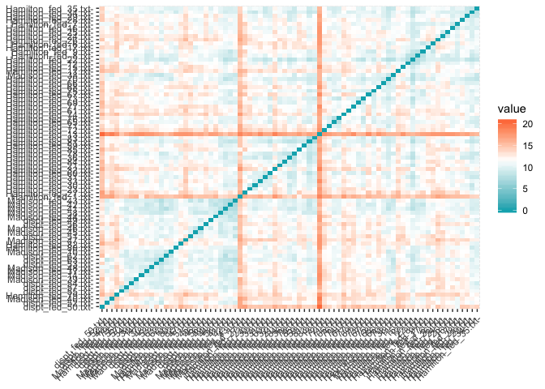
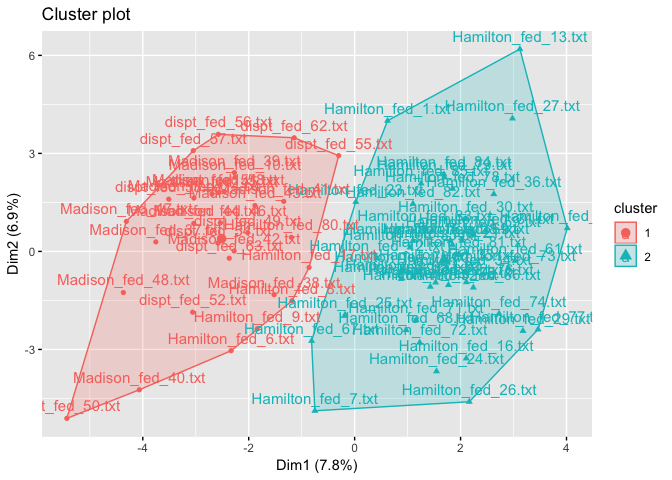
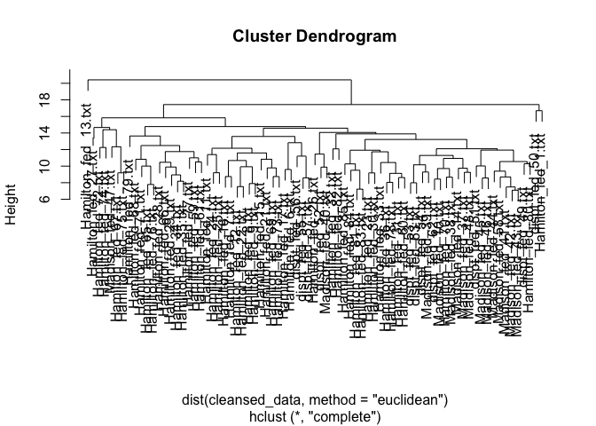

### Introduction
The Federalist Paper data set (Disputed_Essay_data.CSV) is provided. The features are a set of “function words”, for example, “upon”. The feature value is the percentage of the word occurrence in an essay. For example, for the essay “Hamilton_fed_31.txt”, if the function word “upon” appeared 3 times, and the total number of words in this essay is 1000, the feature value is 3/1000=0.3%

### Objective
To find the Author for the disputed essays using Cluster Analysis: K-means and Hierarchical Clustering algorithms.

### Install Packages

```r
#install.packages("dplyr")
#install.packages("ggplot2")
#install.packages("factoextra")
```

### Load Libraries


```r
library(dplyr)
```

```
## 
## Attaching package: 'dplyr'
```

```
## The following objects are masked from 'package:stats':
## 
##     filter, lag
```

```
## The following objects are masked from 'package:base':
## 
##     intersect, setdiff, setequal, union
```

```r
library(ggplot2)
library(factoextra)
```

```
## Welcome! Related Books: `Practical Guide To Cluster Analysis in R` at https://goo.gl/13EFCZ
```


### Load the dataset


```r
disputed_data <- (read.csv("Disputed-Essays-ClusterAnalysis_files/Disputed_Essay_data.csv"))
#Lets see the data:
head(disputed_data)
```

```
##   author         filename     a   all  also    an   and   any   are    as
## 1  dispt dispt_fed_49.txt 0.280 0.052 0.009 0.096 0.358 0.026 0.131 0.122
## 2  dispt dispt_fed_50.txt 0.177 0.063 0.013 0.038 0.393 0.063 0.051 0.139
## 3  dispt dispt_fed_51.txt 0.339 0.090 0.008 0.030 0.301 0.008 0.068 0.203
## 4  dispt dispt_fed_52.txt 0.270 0.024 0.016 0.024 0.262 0.056 0.064 0.111
## 5  dispt dispt_fed_53.txt 0.303 0.054 0.027 0.034 0.404 0.040 0.128 0.148
## 6  dispt dispt_fed_54.txt 0.245 0.059 0.007 0.067 0.282 0.052 0.111 0.252
##      at    be  been   but    by   can    do  down  even every  for.  from
## 1 0.017 0.411 0.026 0.009 0.140 0.035 0.026 0.000 0.009 0.044 0.096 0.044
## 2 0.114 0.393 0.165 0.000 0.139 0.000 0.013 0.000 0.025 0.000 0.076 0.101
## 3 0.023 0.474 0.015 0.038 0.173 0.023 0.000 0.008 0.015 0.023 0.098 0.053
## 4 0.056 0.365 0.127 0.032 0.167 0.056 0.000 0.000 0.024 0.040 0.103 0.079
## 5 0.013 0.344 0.047 0.061 0.209 0.088 0.000 0.000 0.020 0.027 0.141 0.074
## 6 0.015 0.297 0.030 0.037 0.186 0.000 0.000 0.007 0.007 0.007 0.067 0.096
##     had   has  have her   his   if.   in.  into    is    it   its   may
## 1 0.035 0.017 0.044   0 0.017 0.000 0.262 0.009 0.157 0.175 0.070 0.035
## 2 0.101 0.013 0.152   0 0.000 0.025 0.291 0.025 0.038 0.127 0.038 0.038
## 3 0.008 0.015 0.023   0 0.000 0.023 0.308 0.038 0.150 0.173 0.030 0.120
## 4 0.016 0.024 0.143   0 0.024 0.040 0.238 0.008 0.151 0.222 0.048 0.056
## 5 0.000 0.054 0.047   0 0.020 0.034 0.263 0.013 0.189 0.108 0.013 0.047
## 6 0.022 0.015 0.119   0 0.067 0.030 0.401 0.037 0.260 0.156 0.015 0.074
##    more  must my    no   not now    of    on   one  only    or   our shall
## 1 0.026 0.026  0 0.035 0.114   0 0.900 0.140 0.026 0.035 0.096 0.017 0.017
## 2 0.000 0.013  0 0.000 0.127   0 0.747 0.139 0.025 0.000 0.114 0.000 0.000
## 3 0.038 0.083  0 0.030 0.068   0 0.858 0.150 0.030 0.023 0.060 0.000 0.008
## 4 0.056 0.071  0 0.032 0.087   0 0.802 0.143 0.032 0.048 0.064 0.016 0.016
## 5 0.067 0.013  0 0.047 0.128   0 0.869 0.054 0.047 0.027 0.081 0.027 0.000
## 6 0.045 0.015  0 0.059 0.134   0 0.876 0.141 0.052 0.022 0.074 0.030 0.015
##   should    so  some  such  than  that   the their  then there things
## 1  0.017 0.035 0.009 0.026 0.009 0.184 1.425 0.114 0.000 0.009  0.009
## 2  0.013 0.013 0.063 0.000 0.000 0.152 1.254 0.165 0.000 0.000  0.000
## 3  0.068 0.038 0.030 0.045 0.023 0.188 1.490 0.053 0.015 0.015  0.000
## 4  0.032 0.040 0.024 0.008 0.000 0.238 1.326 0.071 0.008 0.000  0.000
## 5  0.000 0.027 0.067 0.027 0.047 0.162 1.193 0.027 0.007 0.007  0.000
## 6  0.030 0.007 0.045 0.015 0.030 0.208 1.469 0.089 0.007 0.007  0.000
##    this    to up  upon   was  were  what  when which   who  will  with
## 1 0.044 0.507  0 0.000 0.009 0.017 0.000 0.009 0.175 0.044 0.009 0.087
## 2 0.051 0.355  0 0.013 0.051 0.000 0.000 0.000 0.114 0.038 0.089 0.063
## 3 0.075 0.361  0 0.000 0.008 0.015 0.008 0.000 0.105 0.008 0.173 0.045
## 4 0.103 0.532  0 0.000 0.087 0.079 0.008 0.024 0.167 0.000 0.079 0.079
## 5 0.094 0.485  0 0.000 0.027 0.020 0.020 0.007 0.155 0.027 0.168 0.074
## 6 0.126 0.445  0 0.000 0.007 0.030 0.015 0.037 0.186 0.045 0.111 0.089
##   would your
## 1 0.192    0
## 2 0.139    0
## 3 0.068    0
## 4 0.064    0
## 5 0.040    0
## 6 0.037    0
```

### Data Cleansing

```r
filtered_dataset <- filter(disputed_data, author != "Jay" & author != "HM")

#Remove the Author column
filtered_data_noauth<- select(filtered_dataset, -c(1))

#Add File names to the row names in the dataset
rownames(filtered_data_noauth) <- filtered_data_noauth[,1]

cleansed_data <- select(filtered_data_noauth, -c(1))

cleansed_data <- na.omit(cleansed_data)
cleansed_data <- scale(cleansed_data)

#Lets see the cleansed data:
head(cleansed_data)
```

```
##                           a         all        also         an
## dispt_fed_49.txt -0.3622794 -0.09598956 0.260520122  0.8452778
## dispt_fed_50.txt -1.8540953  0.35821802 0.765175452 -1.1996900
## dispt_fed_51.txt  0.4922560  1.47309116 0.134356289 -1.4817545
## dispt_fed_52.txt -0.5071159 -1.25215430 1.143666950 -1.6933029
## dispt_fed_53.txt -0.0291554 -0.01340636 2.531469109 -1.3407223
## dispt_fed_54.txt -0.8692071  0.19305163 0.008192457 -0.1772061
##                           and        any        are          as         at
## dispt_fed_49.txt  0.007330061 -0.7355994  1.6659095 -0.04941566 -1.0639764
## dispt_fed_50.txt  0.489147515  0.8852225 -0.7721999  0.41594478  2.6477657
## dispt_fed_51.txt -0.777344077 -1.5241073 -0.2541017  2.16788998 -0.8343841
## dispt_fed_52.txt -1.314226382  0.5785805 -0.3760071 -0.35053124  0.4283735
## dispt_fed_53.txt  0.640575857 -0.1223154  1.5744804  0.66231208 -1.2170379
## dispt_fed_54.txt -1.038902123  0.4033565  1.0563821  3.50922303 -1.1405072
##                          be       been         but        by         can
## dispt_fed_49.txt  1.3401481 -1.1609977 -1.27879942 0.3078297 -0.06886004
## dispt_fed_50.txt  1.0965806  3.1656591 -1.79313952 0.2877084 -1.32276424
## dispt_fed_51.txt  2.1926341 -1.5033950  0.37851869 0.9718326 -0.49877005
## dispt_fed_52.txt  0.7176980  1.9828321  0.03562529 0.8511048  0.68348247
## dispt_fed_53.txt  0.4335360 -0.5073301  1.69294340 1.6961993  1.82990916
## dispt_fed_54.txt -0.2024457 -1.0364896  0.32136979 1.2334095 -1.32276424
##                          do       down       even       every        for.
## dispt_fed_49.txt  3.0056122 -0.4494246 -0.3019129  1.00331525  0.05902901
## dispt_fed_50.txt  1.0236505 -0.4494246  1.3082891 -1.40919864 -0.51269848
## dispt_fed_51.txt -0.9583111  1.6801565  0.3019129 -0.14811183  0.11620176
## dispt_fed_52.txt -0.9583111 -0.4494246  1.2076515  0.78399581  0.25913363
## dispt_fed_53.txt -0.9583111 -0.4494246  0.8051010  0.07120761  1.34541585
## dispt_fed_54.txt -0.9583111  1.4139589 -0.5031881 -1.02538961 -0.76997585
##                         from        had        has       have        her
## dispt_fed_49.txt -1.36621193  0.8983422 -1.1712538 -1.4101364 -0.3448353
## dispt_fed_50.txt  0.92946348  4.6343286 -1.3363550  1.4989914 -0.3448353
## dispt_fed_51.txt -1.00373687 -0.6300158 -1.2538044 -1.9758001 -0.3448353
## dispt_fed_52.txt  0.04341332 -0.1771690 -0.8823267  1.2565641 -0.3448353
## dispt_fed_53.txt -0.15796172 -1.0828626  0.3559325 -1.3293273 -0.3448353
## dispt_fed_54.txt  0.72808844  0.1624662 -1.2538044  0.6100913 -0.3448353
##                          his         if.        in.       into          is
## dispt_fed_49.txt -0.24998632 -1.65090397 -0.8538427 -0.7919193 -0.09362934
## dispt_fed_50.txt -0.65002555 -0.09077135 -0.4479175  0.1435022 -2.16591343
## dispt_fed_51.txt -0.65002555 -0.21558196 -0.2099613  0.9035321 -0.21552840
## dispt_fed_52.txt -0.08526428  0.84530822 -1.1897808 -0.8503831 -0.19811425
## dispt_fed_53.txt -0.17939116  0.47087639 -0.8398453 -0.5580639  0.46362353
## dispt_fed_54.txt  0.92659965  0.22125517  1.0917988  0.8450682  1.70002832
##                           it         its        may       more       must
## dispt_fed_49.txt  0.45333745  0.70343379 -0.9712627 -0.6958500 -0.3436581
## dispt_fed_50.txt -0.66219865 -0.37446476 -0.8703353 -1.7552353 -0.8648728
## dispt_fed_51.txt  0.40685678 -0.64393939  1.8883480 -0.2069029  1.9416680
## dispt_fed_52.txt  1.54563321 -0.03762146 -0.2647707  0.5265177  1.4605467
## dispt_fed_53.txt -1.10376502 -1.21657300 -0.5675530  0.9747192 -0.8648728
## dispt_fed_54.txt  0.01177108 -1.14920434  0.3407939  0.0783162 -0.7846859
##                          my          no        not        now         of
## dispt_fed_49.txt -0.3923745  0.06101229  0.7496569 -0.8621849 -0.3005220
## dispt_fed_50.txt -0.3923745 -1.74589010  1.2303786 -0.8621849 -1.8506313
## dispt_fed_51.txt -0.3923745 -0.19711662 -0.9513583 -0.8621849 -0.7260422
## dispt_fed_52.txt -0.3923745 -0.09386506 -0.2487651 -0.8621849 -1.2934025
## dispt_fed_53.txt -0.3923745  0.68052168  1.2673572 -0.8621849 -0.6145964
## dispt_fed_54.txt -0.3923745  1.30003107  1.4892287 -0.8621849 -0.5436764
##                          on        one        only          or        our
## dispt_fed_49.txt  1.8198016 -0.6185499  0.93822680  0.04839492 -0.1321031
## dispt_fed_50.txt  1.7945402 -0.6699844 -1.56031196  0.54895730 -0.7123814
## dispt_fed_51.txt  2.0724151 -0.4128119  0.08158494 -0.95272984 -0.7123814
## dispt_fed_52.txt  1.8955856 -0.3099429  1.86625548 -0.84149375 -0.1662371
## dispt_fed_53.txt -0.3526747  0.4615745  0.36713223 -0.36874040  0.2092371
## dispt_fed_54.txt  1.8450629  0.7187470  0.01019812 -0.56340354  0.3116392
##                       shall     should         so       some       such
## dispt_fed_49.txt -0.1232427 -0.5135860  0.3577907 -0.6964032 -0.1152754
## dispt_fed_50.txt -1.0000073 -0.7288030 -1.0355366  2.8049806 -1.8504731
## dispt_fed_51.txt -0.5874122  2.2304307  0.5477898  0.6652461  1.1527538
## dispt_fed_52.txt -0.1748171  0.2934777  0.6744560  0.2762034 -1.3165661
## dispt_fed_53.txt -1.0000073 -1.4282582 -0.1488738  3.0643424 -0.0485370
## dispt_fed_54.txt -0.2263915  0.1858692 -1.4155350  1.6378527 -0.8493975
##                        than       that        the      their       then
## dispt_fed_49.txt -1.2833708 -0.5649003  0.7415577  0.8898605 -0.9726424
## dispt_fed_50.txt -1.6232165 -1.1615203 -0.3516007  2.2272054 -0.9726424
## dispt_fed_51.txt -0.7547221 -0.4903228  1.1570858 -0.7097089  1.5349512
## dispt_fed_52.txt -1.6232165  0.4418959  0.1086766 -0.2377048  0.3647409
## dispt_fed_53.txt  0.1515329 -0.9750766 -0.7415577 -1.3914925  0.1975680
## dispt_fed_54.txt -0.4903977 -0.1174353  1.0228383  0.2342993  0.1975680
##                       there     things       this         to         up
## dispt_fed_49.txt -0.8587460  1.3665765 -1.6643555 -0.3708016 -0.5068037
## dispt_fed_50.txt -1.2646880 -0.6313929 -1.4114410 -1.8479502 -0.5068037
## dispt_fed_51.txt -0.5881180 -0.6313929 -0.5443057 -1.7896417 -0.5068037
## dispt_fed_52.txt -1.2646880 -0.6313929  0.4673522 -0.1278496 -0.5068037
## dispt_fed_53.txt -0.9489553 -0.6313929  0.1421764 -0.5845995 -0.5068037
## dispt_fed_54.txt -0.9489553 -0.6313929  1.2983568 -0.9733228 -0.5068037
##                        upon        was        were       what       when
## dispt_fed_49.txt -1.1659945 -0.6294125 -0.09089038 -1.1892827 -0.1525802
## dispt_fed_50.txt -0.6913461  1.3334805 -1.05037024 -1.1892827 -0.8436786
## dispt_fed_51.txt -1.1659945 -0.6761480 -0.20377036 -0.4522624 -0.8436786
## dispt_fed_52.txt -1.1659945  3.0159601  3.40838912 -0.4522624  0.9992506
## dispt_fed_53.txt -1.1659945  0.2118273  0.07842960  0.6532679 -0.3061576
## dispt_fed_54.txt -1.1659945 -0.7228836  0.64282952  0.1926303  1.9975039
##                       which        who       will        with      would
## dispt_fed_49.txt  0.3103717  0.5731684 -1.4229978  0.35543663  1.3006636
## dispt_fed_50.txt -1.1909835  0.3143182 -0.1729028 -0.59376408  0.5247525
## dispt_fed_51.txt -1.4124949 -0.9799331  1.1396970 -1.30566461 -0.5146757
## dispt_fed_52.txt  0.1134727 -1.3250668 -0.3291646  0.03903639 -0.5732350
## dispt_fed_53.txt -0.1818759 -0.1602406  1.0615661 -0.15871375 -0.9245910
## dispt_fed_54.txt  0.5811079  0.6163101  0.1708734  0.43453669 -0.9685105
##                       your
## dispt_fed_49.txt -0.189974
## dispt_fed_50.txt -0.189974
## dispt_fed_51.txt -0.189974
## dispt_fed_52.txt -0.189974
## dispt_fed_53.txt -0.189974
## dispt_fed_54.txt -0.189974
```

### Building Cluster Analysis using K-Means

```r
distance <- get_dist(cleansed_data, method = "euclidean")
fviz_dist(distance, gradient = list(low = "#00AFBB", mid = "white", high = "#FC4E07"))
```

<!-- -->

```r
km_output <- kmeans(cleansed_data, centers = 2, nstart = 25, iter.max = 100, algorithm = "Hartigan-Wong")
fviz_cluster(km_output, data = cleansed_data)
```

<!-- -->

From above we can conclude that the disputed essays were written by *Madison*.

### Building Cluster using HAC (Hierarchical Clustering)


```r
hac_output <- hclust(dist(cleansed_data, method = "euclidean"), method = "complete")
plot(hac_output)
```

<!-- -->

```r
#hac cut at multiple levels
hac_cut <- cutree(hac_output, 1)
table(hac_cut, filtered_dataset$author)
```

```
##        
## hac_cut dispt Hamilton HM Jay Madison
##       1    11       51  0   0      15
```

```r
hac_cut <- cutree(hac_output, 2)
table(hac_cut, filtered_dataset$author)
```

```
##        
## hac_cut dispt Hamilton HM Jay Madison
##       1    11       50  0   0      15
##       2     0        1  0   0       0
```

```r
hac_cut <- cutree(hac_output, 5)
table(hac_cut, filtered_dataset$author)
```

```
##        
## hac_cut dispt Hamilton HM Jay Madison
##       1    10       44  0   0      14
##       2     1        0  0   0       0
##       3     0        1  0   0       0
##       4     0        1  0   0       0
##       5     0        5  0   0       1
```

```r
hac_cut <- cutree(hac_output, 10)
table(hac_cut, filtered_dataset$author)
```

```
##        
## hac_cut dispt Hamilton HM Jay Madison
##      1      6       15  0   0      13
##      2      1        0  0   0       0
##      3      1        1  0   0       1
##      4      3       15  0   0       0
##      5      0        1  0   0       0
##      6      0        1  0   0       0
##      7      0        1  0   0       0
##      8      0       13  0   0       0
##      9      0        2  0   0       1
##      10     0        2  0   0       0
```

```r
hac_cut <- cutree(hac_output, 15)
table(hac_cut, filtered_dataset$author)
```

```
##        
## hac_cut dispt Hamilton HM Jay Madison
##      1      6        2  0   0      13
##      2      1        0  0   0       0
##      3      1        1  0   0       1
##      4      3        0  0   0       0
##      5      0        1  0   0       0
##      6      0       13  0   0       0
##      7      0        1  0   0       0
##      8      0        2  0   0       0
##      9      0       11  0   0       0
##      10     0        1  0   0       0
##      11     0       12  0   0       0
##      12     0        2  0   0       0
##      13     0        2  0   0       1
##      14     0        2  0   0       0
##      15     0        1  0   0       0
```

```r
hac_cut <- cutree(hac_output, 20)
table(hac_cut, filtered_dataset$author)
```

```
##        
## hac_cut dispt Hamilton HM Jay Madison
##      1      2        1  0   0       7
##      2      1        0  0   0       0
##      3      1        1  0   0       1
##      4      4        1  0   0       6
##      5      3        0  0   0       0
##      6      0        1  0   0       0
##      7      0        3  0   0       0
##      8      0       10  0   0       0
##      9      0        1  0   0       0
##      10     0        2  0   0       0
##      11     0       11  0   0       0
##      12     0        1  0   0       0
##      13     0        8  0   0       0
##      14     0        2  0   0       0
##      15     0        4  0   0       0
##      16     0        2  0   0       0
##      17     0        1  0   0       0
##      18     0        1  0   0       0
##      19     0        1  0   0       0
##      20     0        0  0   0       1
```

```r
hac_cut <- cutree(hac_output, 25)
table(hac_cut, filtered_dataset$author)
```

```
##        
## hac_cut dispt Hamilton HM Jay Madison
##      1      1        1  0   0       5
##      2      1        0  0   0       0
##      3      1        0  0   0       2
##      4      1        1  0   0       1
##      5      4        1  0   0       6
##      6      3        0  0   0       0
##      7      0        1  0   0       0
##      8      0        3  0   0       0
##      9      0       10  0   0       0
##      10     0        1  0   0       0
##      11     0        2  0   0       0
##      12     0        2  0   0       0
##      13     0        1  0   0       0
##      14     0        5  0   0       0
##      15     0        5  0   0       0
##      16     0        1  0   0       0
##      17     0        3  0   0       0
##      18     0        4  0   0       0
##      19     0        2  0   0       0
##      20     0        1  0   0       0
##      21     0        1  0   0       0
##      22     0        1  0   0       0
##      23     0        4  0   0       0
##      24     0        1  0   0       0
##      25     0        0  0   0       1
```

From above results, at cut 9 shows there is no equality between disputes and Hamilton and at cut 5, we can see there is a link between disputes and Madison. Alos cuts 1 through 6, there is a link with Madison but not with Hamiltion. From the HAC, we can conclude that the disputed essays are written by *Madison*.


### Conclusion
From both the models- K-Means and HAC, we can see the disputed Federal essays are written by *Madison*.

### References

1. Euclidean Distance
2. Hierarchical clustering documentation
