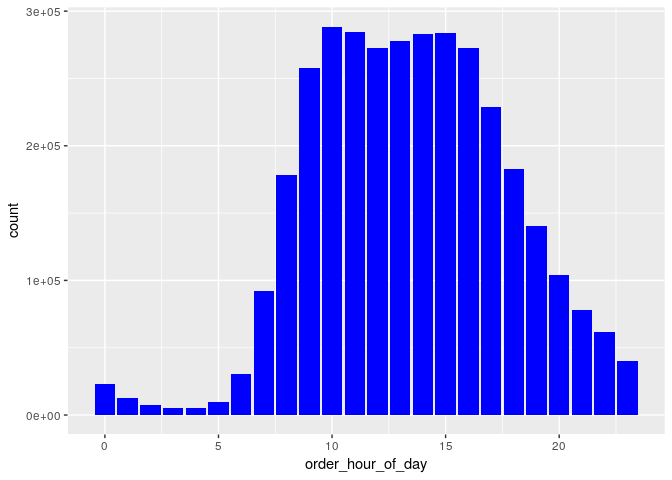
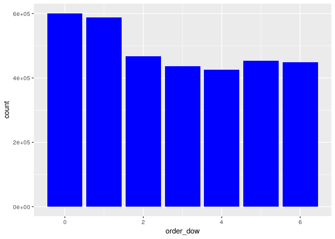
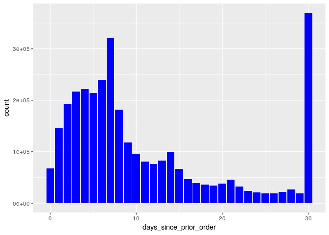
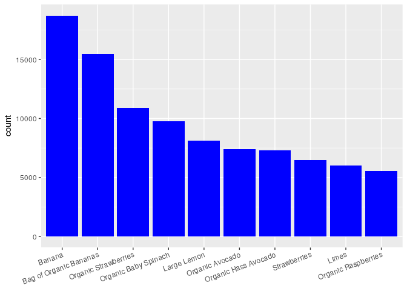
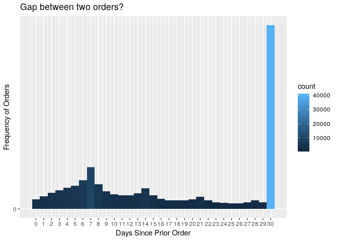
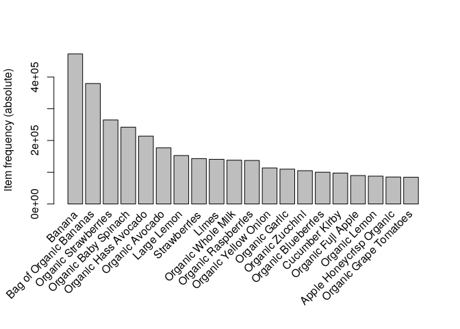
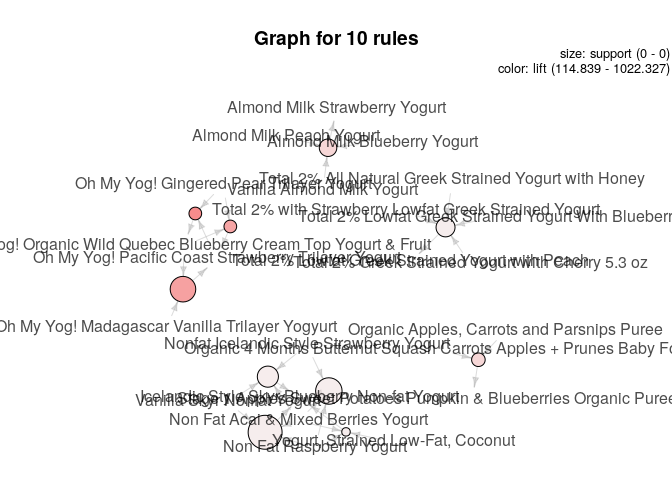
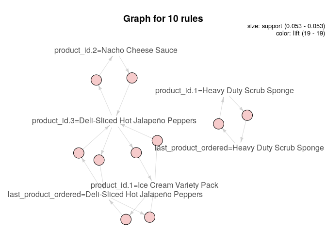

  


### Introduction

The data we are exploring is a set of over three million Instacart grocery shopping transactions that have been made publicly available [1]. 

The data includes orders with many attributes including; day of week, hour of the day, days since last order, and an evaluation identifier. Since the data set is designed for mining education and training, each order has been designated to the purpose of training, testing, and prior orders. There are nearly two-hundred thousand training records in the set which is a very large amount to process with a personal computer, so we plan to do random samplings of one-thousand records between ten and twenty times to train the models we use to make predictions

Plan is to make recommendations about staffing based on purchase time and day of the week so in order to use decision trees or random forest the data will need to be categorized to the time of day; day (7a - 3p), evening (3p - 11p), overnight (11p - 7a). The data will also need to be aggregated to determine customer value, by selecting a specific period of time for example 90 days, so that the highest dollar value ordering individuals can be identified to draw conclusions about shopping patterns. 

At this point, we know that our primary strategies will be to use decision trees, random forests, and other techniques learned in class to make grouping or classification decisions from the training data to make predictions about the test data about those classifications. 

### Install Required packages

```r
#install.packages('dplyr')
#install.packages('ggplot2')
#install.packages('arulesViz')
#install.packages('caret')
#install.packages('e1071')
```

### Load Required Libraries

```r
library(plyr)
library(dplyr)
```

```
## 
## Attaching package: 'dplyr'
```

```
## The following objects are masked from 'package:plyr':
## 
##     arrange, count, desc, failwith, id, mutate, rename, summarise,
##     summarize
```

```
## The following objects are masked from 'package:stats':
## 
##     filter, lag
```

```
## The following objects are masked from 'package:base':
## 
##     intersect, setdiff, setequal, union
```

```r
library(magrittr)
library(knitr)
library(ggplot2)
```

```
## Registered S3 methods overwritten by 'ggplot2':
##   method         from 
##   [.quosures     rlang
##   c.quosures     rlang
##   print.quosures rlang
```

```r
library(arules)
```

```
## Loading required package: Matrix
```

```
## 
## Attaching package: 'arules'
```

```
## The following object is masked from 'package:dplyr':
## 
##     recode
```

```
## The following objects are masked from 'package:base':
## 
##     abbreviate, write
```

```r
library(arulesViz)
```

```
## Loading required package: grid
```

```
## Registered S3 method overwritten by 'seriation':
##   method         from 
##   reorder.hclust gclus
```

```r
library(nnet)
library(lattice)
library(caret)
library(e1071)
library(readr)
library(klaR)
```

```
## Loading required package: MASS
```

```
## 
## Attaching package: 'MASS'
```

```
## The following object is masked from 'package:dplyr':
## 
##     select
```

### Load Datasets

```r
orders <- read.csv('instacart-cuseminers_files/dataset/orders.csv')
products <- read.csv('instacart-cuseminers_files/dataset/products.csv')
order_products <- read.csv('instacart-cuseminers_files/dataset/order_products__train.csv')
order_products_prior <- read.csv('instacart-cuseminers_files/dataset/order_products__prior.csv')
order_products_train <- read.csv('instacart-cuseminers_files/dataset/order_products__train.csv')
aisles <- read.csv('instacart-cuseminers_files/dataset/aisles.csv')
departments <- read.csv('instacart-cuseminers_files/dataset/departments.csv')
train_orders_orig <- filter(orders, eval_set == "train")
test_orders_orig <- filter(orders, eval_set == "prior")
```

### Lets see the data

```r
dim(orders); kable(head(orders,10))
```

```
## [1] 3421083       7
```


 order_id   user_id  eval_set    order_number   order_dow   order_hour_of_day   days_since_prior_order
---------  --------  ---------  -------------  ----------  ------------------  -----------------------
  2539329         1  prior                  1           2                   8                       NA
  2398795         1  prior                  2           3                   7                       15
   473747         1  prior                  3           3                  12                       21
  2254736         1  prior                  4           4                   7                       29
   431534         1  prior                  5           4                  15                       28
  3367565         1  prior                  6           2                   7                       19
   550135         1  prior                  7           1                   9                       20
  3108588         1  prior                  8           1                  14                       14
  2295261         1  prior                  9           1                  16                        0
  2550362         1  prior                 10           4                   8                       30

```r
dim(order_products); kable(head(order_products, 10))
```

```
## [1] 1384617       4
```


 order_id   product_id   add_to_cart_order   reordered
---------  -----------  ------------------  ----------
        1        49302                   1           1
        1        11109                   2           1
        1        10246                   3           0
        1        49683                   4           0
        1        43633                   5           1
        1        13176                   6           0
        1        47209                   7           0
        1        22035                   8           1
       36        39612                   1           0
       36        19660                   2           1

```r
dim(products); kable(head(products,10))
```

```
## [1] 49688     4
```


 product_id  product_name                                                         aisle_id   department_id
-----------  ------------------------------------------------------------------  ---------  --------------
          1  Chocolate Sandwich Cookies                                                 61              19
          2  All-Seasons Salt                                                          104              13
          3  Robust Golden Unsweetened Oolong Tea                                       94               7
          4  Smart Ones Classic Favorites Mini Rigatoni With Vodka Cream Sauce          38               1
          5  Green Chile Anytime Sauce                                                   5              13
          6  Dry Nose Oil                                                               11              11
          7  Pure Coconut Water With Orange                                             98               7
          8  Cut Russet Potatoes Steam N' Mash                                         116               1
          9  Light Strawberry Blueberry Yogurt                                         120              16
         10  Sparkling Orange Juice & Prickly Pear Beverage                            115               7

```r
dim(order_products_prior); kable(head(order_products_prior,10))
```

```
## [1] 32434489        4
```


 order_id   product_id   add_to_cart_order   reordered
---------  -----------  ------------------  ----------
        2        33120                   1           1
        2        28985                   2           1
        2         9327                   3           0
        2        45918                   4           1
        2        30035                   5           0
        2        17794                   6           1
        2        40141                   7           1
        2         1819                   8           1
        2        43668                   9           0
        3        33754                   1           1

```r
dim(aisles); kable(head(aisles,10))
```

```
## [1] 134   2
```


 aisle_id  aisle                      
---------  ---------------------------
        1  prepared soups salads      
        2  specialty cheeses          
        3  energy granola bars        
        4  instant foods              
        5  marinades meat preparation 
        6  other                      
        7  packaged meat              
        8  bakery desserts            
        9  pasta sauce                
       10  kitchen supplies           

```r
dim(departments); kable(head(departments, 10))
```

```
## [1] 21  2
```


 department_id  department      
--------------  ----------------
             1  frozen          
             2  other           
             3  bakery          
             4  produce         
             5  alcohol         
             6  international   
             7  beverages       
             8  pets            
             9  dry goods pasta 
            10  bulk            


### Data Cleansing

```r
#Factoring
orders <- orders %>% mutate(order_hour_of_day = as.numeric(order_hour_of_day), eval_set = as.factor(eval_set))
products <- products %>% mutate(product_name = as.factor(product_name))
aisles <- aisles %>% mutate(aisle = as.factor(aisle))
departments <- departments %>% mutate(department = as.factor(department))
```


### Data Visualizations

1. Lets see in which hours the orders are placed.

```r
orders %>%
  ggplot(aes(x=order_hour_of_day)) +
  geom_histogram(stat="count",fill="blue")
```

<!-- -->

From above, we can see the orders are getting increased from 8 AM until 6 PM, with peak hours as 10 and 11 AM.

2. Lets see on which day


```r
orders %>% 
  ggplot(aes(x=order_dow)) + 
  geom_histogram(stat="count",fill="blue")
```

<!-- -->
This shows, the most of the orders are on 0 and 1 (Saturday and Sunday).

***From above two visualizations, we can conclude, we need full staff to be available on Weekends and also during 8 AM - 6 PM as primary shift***
  
  
  3. Reorder frequency 


```r
orders %>% 
  ggplot(aes(x=days_since_prior_order)) + 
  geom_histogram(stat="count",fill="blue")
```

<!-- -->

We can see the reorder frequency for most of the customers is seven and 30 days.

4. Find the best seller


```r
best_sellers <- order_products %>% 
  group_by(product_id) %>% 
  summarize(count = n()) %>% 
  top_n(10, wt = count) %>%
  left_join(dplyr::select(products,product_id,product_name),by="product_id") %>%
  arrange(desc(count)) 
kable(best_sellers)
```


 product_id   count  product_name           
-----------  ------  -----------------------
      24852   18726  Banana                 
      13176   15480  Bag of Organic Bananas 
      21137   10894  Organic Strawberries   
      21903    9784  Organic Baby Spinach   
      47626    8135  Large Lemon            
      47766    7409  Organic Avocado        
      47209    7293  Organic Hass Avocado   
      16797    6494  Strawberries           
      26209    6033  Limes                  
      27966    5546  Organic Raspberries    

```r
best_sellers %>% 
  ggplot(aes(x=reorder(product_name,-count), y=count))+
  geom_bar(stat="identity",fill="blue")+
  theme(axis.text.x=element_text(angle=20, hjust=1),axis.title.x = element_blank())
```

<!-- -->

***Bananas*** is the best selling product from the store.


### Customer Reordering Frequency


```r
#Visualizing reordering Gap
Reordering_Gap_plot<-ggplot(train_orders_orig,aes(x=days_since_prior_order))+
  geom_histogram(aes(fill=..count..),binwidth=1)+
  scale_x_continuous(name = "Days Since Prior Order",breaks = seq(0, 30, 1))+
  scale_y_continuous(name = "Frequency of Orders",breaks=seq(0,1000000,100000))+
  ggtitle("Gap between two orders?")+
  labs(x="Days Since Prior Order")+
  theme_update()
Reordering_Gap_plot
```

<!-- -->
Looking at above data we see that majority of customers order weekly, biweekly, monthly so we need to categorize them appropriately.


```r
train_orders <- train_orders_orig %<>%
  mutate(wk_mth=case_when(
    days_since_prior_order %in% 1:7 ~ "Weekly",
    days_since_prior_order %in% 8:14 ~ "Biweekly",
    days_since_prior_order %in% 15:30 ~ "Monthly"
  ))

head(train_orders)
```

```
##   order_id user_id eval_set order_number order_dow order_hour_of_day
## 1  1187899       1    train           11         4                 8
## 2  1492625       2    train           15         1                11
## 3  2196797       5    train            5         0                11
## 4   525192       7    train           21         2                11
## 5   880375       8    train            4         1                14
## 6  1094988       9    train            4         6                10
##   days_since_prior_order   wk_mth
## 1                     14 Biweekly
## 2                     30  Monthly
## 3                      6   Weekly
## 4                      6   Weekly
## 5                     10 Biweekly
## 6                     30  Monthly
```

```r
test_orders <- test_orders_orig %<>%
  mutate(wk_mth=case_when(
    days_since_prior_order %in% 1:7 ~ "Weekly",
    days_since_prior_order %in% 8:14 ~ "Biweekly",
    days_since_prior_order %in% 15:30 ~ "Monthly"
  ))
head(test_orders)
```

```
##   order_id user_id eval_set order_number order_dow order_hour_of_day
## 1  2539329       1    prior            1         2                 8
## 2  2398795       1    prior            2         3                 7
## 3   473747       1    prior            3         3                12
## 4  2254736       1    prior            4         4                 7
## 5   431534       1    prior            5         4                15
## 6  3367565       1    prior            6         2                 7
##   days_since_prior_order  wk_mth
## 1                     NA    <NA>
## 2                     15 Monthly
## 3                     21 Monthly
## 4                     29 Monthly
## 5                     28 Monthly
## 6                     19 Monthly
```


```r
# Create factor for weekly, biweekly, monthly
str(train_orders)
```

```
## 'data.frame':	131209 obs. of  8 variables:
##  $ order_id              : int  1187899 1492625 2196797 525192 880375 1094988 1822501 1827621 2316178 2180313 ...
##  $ user_id               : int  1 2 5 7 8 9 10 13 14 17 ...
##  $ eval_set              : Factor w/ 3 levels "prior","test",..: 3 3 3 3 3 3 3 3 3 3 ...
##  $ order_number          : int  11 15 5 21 4 4 6 13 14 41 ...
##  $ order_dow             : int  4 1 0 2 1 6 0 0 2 3 ...
##  $ order_hour_of_day     : int  8 11 11 11 14 10 19 21 19 10 ...
##  $ days_since_prior_order: num  14 30 6 6 10 30 30 8 11 30 ...
##  $ wk_mth                : chr  "Biweekly" "Monthly" "Weekly" "Weekly" ...
```

```r
str(test_orders)
```

```
## 'data.frame':	3214874 obs. of  8 variables:
##  $ order_id              : int  2539329 2398795 473747 2254736 431534 3367565 550135 3108588 2295261 2550362 ...
##  $ user_id               : int  1 1 1 1 1 1 1 1 1 1 ...
##  $ eval_set              : Factor w/ 3 levels "prior","test",..: 1 1 1 1 1 1 1 1 1 1 ...
##  $ order_number          : int  1 2 3 4 5 6 7 8 9 10 ...
##  $ order_dow             : int  2 3 3 4 4 2 1 1 1 4 ...
##  $ order_hour_of_day     : int  8 7 12 7 15 7 9 14 16 8 ...
##  $ days_since_prior_order: num  NA 15 21 29 28 19 20 14 0 30 ...
##  $ wk_mth                : chr  NA "Monthly" "Monthly" "Monthly" ...
```

```r
# train_orders <- train_orders %>% mutate(order_hour_of_day = as.numeric(order_hour_of_day), wk_mth = as.factor(wk_mth))
train_orders$wk_mth <- as.factor(train_orders$wk_mth)  # As Category
test_orders$wk_mth <- as.factor(test_orders$wk_mth)
# All the other columns are numeric.
```

### Modelling with Neural Net


```r
# train model with neural networks

TrainingParameters <- trainControl(method = "repeatedcv", number = 10, repeats=10)

NNModel <- train(train_orders[,-8], train_orders$wk_mth,
                   method = "nnet",
                  trControl= TrainingParameters,
                  preProcess=c("scale","center"),
                  na.action = na.omit
 )
```

```
## Warning in nominalTrainWorkflow(x = x, y = y, wts = weights, info =
## trainInfo, : There were missing values in resampled performance measures.
```


```r
NNModel
```

```
## Neural Network 
## 
## 131209 samples
##      7 predictor
##      3 classes: 'Biweekly', 'Monthly', 'Weekly' 
## 
## Pre-processing: scaled (6), centered (6), ignore (1) 
## Resampling: Cross-Validated (10 fold, repeated 10 times) 
## Summary of sample sizes: 129083, 118300, 118301, 118300, 118300, 118300, ... 
## Resampling results across tuning parameters:
## 
##   size  decay  Accuracy   Kappa    
##   1     0e+00  0.9655092  0.9419639
##   1     1e-04  0.9698376  0.9493426
##   1     1e-01  1.0000000  1.0000000
##   3     0e+00  0.9999985  0.9999975
##   3     1e-04  1.0000000  1.0000000
##   3     1e-01  1.0000000  1.0000000
##   5     0e+00  0.9999985  0.9999975
##   5     1e-04  0.9999985  0.9999975
##   5     1e-01  0.9999992  0.9999987
## 
## Accuracy was used to select the optimal model using the largest value.
## The final values used for the model were size = 1 and decay = 0.1.
```

```r
NNPredictions <-predict(NNModel, test_orders,)

# Create confusion matrix
cmNN <-confusionMatrix(NNPredictions, test_orders$wk_mth)
print(cmNN)
```

```
## Confusion Matrix and Statistics
## 
##           Reference
## Prediction Biweekly Monthly  Weekly
##   Biweekly   318579  141587       0
##   Monthly         0  611418       0
##   Weekly     375641       0 1497004
## 
## Overall Statistics
##                                           
##                Accuracy : 0.8243          
##                  95% CI : (0.8239, 0.8248)
##     No Information Rate : 0.5085          
##     P-Value [Acc > NIR] : < 2.2e-16       
##                                           
##                   Kappa : 0.7005          
##                                           
##  Mcnemar's Test P-Value : NA              
## 
## Statistics by Class:
## 
##                      Class: Biweekly Class: Monthly Class: Weekly
## Sensitivity                   0.4589         0.8120        1.0000
## Specificity                   0.9371         1.0000        0.7404
## Pos Pred Value                0.6923         1.0000        0.7994
## Neg Pred Value                0.8488         0.9393        1.0000
## Prevalence                    0.2358         0.2558        0.5085
## Detection Rate                0.1082         0.2077        0.5085
## Detection Prevalence          0.1563         0.2077        0.6360
## Balanced Accuracy             0.6980         0.9060        0.8702
```

*From above, we can estimate the marketing communications on the customer ordering frequency and predict the future orders.*

### Product Associations (Market-Basket Analysis)


```r
#attaching product id to orders
prod_prior_names <- join(order_products_prior, products, by='product_id', type='left', match='all')
prod_train_names <- join(order_products_train, products, by='product_id', type='left', match='all')

#attaching department name to each product
prod_prior_dept <- join(prod_prior_names, departments, by='department_id', type='left', match='all')
prod_train_dept <- join(prod_train_names, departments, by='department_id', type='left', match='all')

#attaching aisle_id to product
prod_prior_dept_ai <- join(prod_prior_dept, aisles, by='aisle_id', type='left', match='all')
prod_train_dept_ai <- join(prod_train_dept, aisles, by='aisle_id', type='left', match='all')

#attaching the order and user information to the products ordered
prod_prior_orders <- join(prod_prior_dept_ai, orders, by='order_id', type='left', match='all')
prod_train_orders <- join(prod_train_dept_ai, orders, by='order_id', type='left', match='all')

#save final data frame in R data system
saveRDS(prod_prior_orders, "prior.rds")
saveRDS(prod_train_orders, "train.rds")

#save the data frame into csv files
write.csv(prod_prior_orders, "prior.csv")
write.csv(prod_train_orders, "train.csv")

prior_sorted <- prod_prior_orders[order(prod_prior_orders$order_id),]
```


```r
itemList <- ddply(prior_sorted,c("order_id"), 
                  function(df1)paste(df1$product_name, 
                                     collapse = "|"))
itemList$order_id <- NULL
colnames(itemList) <- c("items")
#write.csv(itemList, "basket.csv", quote=FALSE, row.names = TRUE)
write.table(itemList, "basket.csv", quote=FALSE, row.names = TRUE, sep = "|" )

#Read Transactions
transactions <- read.transactions('basket.csv', format = 'basket', quote="", sep='|')
transactions
```

```
## transactions in sparse format with
##  3214875 transactions (rows) and
##  3264549 items (columns)
```

```r
summary(transactions)
```

```
## transactions as itemMatrix in sparse format with
##  3214875 rows (elements/itemsets/transactions) and
##  3264549 columns (items) and a density of 3.396757e-06 
## 
## most frequent items:
##                 Banana Bag of Organic Bananas   Organic Strawberries 
##                 472565                 379450                 264683 
##   Organic Baby Spinach   Organic Hass Avocado                (Other) 
##                 241921                 213584               34077161 
## 
## element (itemset/transaction) length distribution:
## sizes
##      1      2      3      4      5      6      7      8      9     10 
##      1 156748 186993 207027 222081 228330 227675 220006 203374 184347 
##     11     12     13     14     15     16     17     18     19     20 
## 165550 147461 131580 116871 103683  91644  81192  71360  62629  54817 
##     21     22     23     24     25     26     27     28     29     30 
##  48096  41863  36368  31672  27065  23613  20283  17488  15102  13033 
##     31     32     33     34     35     36     37     38     39     40 
##  11251   9571   8035   6991   6041   5164   4407   3681   3169   2653 
##     41     42     43     44     45     46     47     48     49     50 
##   2272   1978   1642   1412   1227   1048    895    743    608    563 
##     51     52     53     54     55     56     57     58     59     60 
##    491    394    348    288    275    224    175    159    165    119 
##     61     62     63     64     65     66     67     68     69     70 
##    121    100     79     67     57     53     49     44     39     24 
##     71     72     73     74     75     76     77     78     79     80 
##     33     30     23     22     24      9     11     15      9      7 
##     81     82     83     84     85     86     87     88     89     90 
##      7      5      9      4     10      5      7      4      7      4 
##     91     92     93     94     95     96     97     99    100    101 
##      1      4      9      4      1      4      3      4      2      4 
##    102    103    105    106    109    110    113    115    116    117 
##      2      3      2      1      2      2      1      1      1      1 
##    122    128    138    146 
##      1      1      1      1 
## 
##    Min. 1st Qu.  Median    Mean 3rd Qu.    Max. 
##    1.00    6.00    9.00   11.09   15.00  146.00 
## 
## includes extended item information - examples:
##                                          labels
## 1                         .5\\" Waterproof Tape
## 2                      'Swingtop' Premium Lager
## 3 (70% Juice!) Mountain Raspberry Juice Squeeze
```

```r
itemFrequencyPlot(transactions, topN=20, type='absolute')
```

<!-- -->

```r
#Build Rules with atleast confidence of 70% and support of 0.0001555 (500 Transactions).
rules <- apriori(transactions, parameter = list(supp=0.0001555, conf=0.7, minlen=2, maxtime=120))
```

```
## Apriori
## 
## Parameter specification:
##  confidence minval smax arem  aval originalSupport maxtime   support
##         0.7    0.1    1 none FALSE            TRUE     120 0.0001555
##  minlen maxlen target   ext
##       2     10  rules FALSE
## 
## Algorithmic control:
##  filter tree heap memopt load sort verbose
##     0.1 TRUE TRUE  FALSE TRUE    2    TRUE
## 
## Absolute minimum support count: 499 
## 
## set item appearances ...[0 item(s)] done [0.00s].
## set transactions ...[3264549 item(s), 3214875 transaction(s)] done [21.09s].
## sorting and recoding items ... [8290 item(s)] done [1.29s].
## creating transaction tree ... done [4.39s].
## checking subsets of size 1 2 3 4 5 done [8.91s].
## writing ... [39 rule(s)] done [0.10s].
## creating S4 object  ... done [1.70s].
```

```r
rules <- sort(rules, by='lift', decreasing = TRUE)
summary(rules)
```

```
## set of 39 rules
## 
## rule length distribution (lhs + rhs):sizes
##  3  4  5 
##  4 23 12 
## 
##    Min. 1st Qu.  Median    Mean 3rd Qu.    Max. 
##   3.000   4.000   4.000   4.205   5.000   5.000 
## 
## summary of quality measures:
##     support            confidence          lift             count       
##  Min.   :0.0001565   Min.   :0.7079   Min.   :  31.77   Min.   : 503.0  
##  1st Qu.:0.0001851   1st Qu.:0.7261   1st Qu.:  35.42   1st Qu.: 595.0  
##  Median :0.0002134   Median :0.7510   Median :  71.79   Median : 686.0  
##  Mean   :0.0002478   Mean   :0.7659   Mean   : 148.31   Mean   : 796.7  
##  3rd Qu.:0.0002698   3rd Qu.:0.8017   3rd Qu.: 112.26   3rd Qu.: 867.5  
##  Max.   :0.0004591   Max.   :0.8841   Max.   :1022.33   Max.   :1476.0  
## 
## mining info:
##          data ntransactions   support confidence
##  transactions       3214875 0.0001555        0.7
```

```r
#Lets see the top 20 rules.
cat('Top 20 product association rules:')
```

```
## Top 20 product association rules:
```

```r
inspect(rules[1:20])
```

```
##      lhs                                                                      rhs                                                                                 support confidence       lift count
## [1]  {Oh My Yog! Gingered Pear Trilayer Yogurt,                                                                                                                                                      
##       Oh My Yog! Pacific Coast Strawberry Trilayer Yogurt}                 => {Oh My Yog! Organic Wild Quebec Blueberry Cream Top Yogurt & Fruit}            0.0001838330  0.7224939 1022.32726   591
## [2]  {Oh My Yog! Madagascar Vanilla Trilayer Yogyurt,                                                                                                                                                
##       Oh My Yog! Organic Wild Quebec Blueberry Cream Top Yogurt & Fruit}   => {Oh My Yog! Pacific Coast Strawberry Trilayer Yogurt}                          0.0002385785  0.7794715  877.11011   767
## [3]  {Oh My Yog! Gingered Pear Trilayer Yogurt,                                                                                                                                                      
##       Oh My Yog! Organic Wild Quebec Blueberry Cream Top Yogurt & Fruit}   => {Oh My Yog! Pacific Coast Strawberry Trilayer Yogurt}                          0.0001838330  0.7509530  845.01924   591
## [4]  {Almond Milk Blueberry Yogurt,                                                                                                                                                                  
##       Almond Milk Peach Yogurt,                                                                                                                                                                      
##       Vanilla Almond Milk Yogurt}                                          => {Almond Milk Strawberry Yogurt}                                                0.0002043625  0.7423729  417.31702   657
## [5]  {Organic 4 Months Butternut Squash Carrots Apples + Prunes Baby Food,                                                                                                                           
##       Organic Apples, Carrots and Parsnips Puree}                          => {Stage 1 Apples Sweet Potatoes Pumpkin & Blueberries Organic Pureed Baby Food} 0.0001875656  0.7144550  411.55410   603
## [6]  {Non Fat Acai & Mixed Berries Yogurt,                                                                                                                                                           
##       Non Fat Raspberry Yogurt,                                                                                                                                                                      
##       Yogurt, Strained Low-Fat, Coconut}                                   => {Icelandic Style Skyr Blueberry Non-fat Yogurt}                                0.0001657918  0.7361878  122.90346   533
## [7]  {Non Fat Acai & Mixed Berries Yogurt,                                                                                                                                                           
##       Nonfat Icelandic Style Strawberry Yogurt,                                                                                                                                                      
##       Vanilla Skyr Nonfat Yogurt}                                          => {Icelandic Style Skyr Blueberry Non-fat Yogurt}                                0.0002196042  0.7354167  122.77471   706
## [8]  {Non Fat Acai & Mixed Berries Yogurt,                                                                                                                                                           
##       Non Fat Raspberry Yogurt,                                                                                                                                                                      
##       Nonfat Icelandic Style Strawberry Yogurt}                            => {Icelandic Style Skyr Blueberry Non-fat Yogurt}                                0.0002423111  0.7273576  121.42929   779
## [9]  {Non Fat Acai & Mixed Berries Yogurt,                                                                                                                                                           
##       Non Fat Raspberry Yogurt,                                                                                                                                                                      
##       Vanilla Skyr Nonfat Yogurt}                                          => {Icelandic Style Skyr Blueberry Non-fat Yogurt}                                0.0002740386  0.7145174  119.28568   881
## [10] {Total 2% All Natural Greek Strained Yogurt with Honey,                                                                                                                                         
##       Total 2% Greek Strained Yogurt with Cherry 5.3 oz,                                                                                                                                             
##       Total 2% Lowfat Greek Strained Yogurt With Blueberry,                                                                                                                                          
##       Total 2% with Strawberry Lowfat Greek Strained Yogurt}               => {Total 2% Lowfat Greek Strained Yogurt with Peach}                             0.0002105836  0.7111345  114.83868   677
## [11] {Total 2% All Natural Greek Strained Yogurt with Honey,                                                                                                                                         
##       Total 2% Greek Strained Yogurt with Cherry 5.3 oz,                                                                                                                                             
##       Total 2% Lowfat Greek Strained Yogurt with Peach,                                                                                                                                              
##       Total 2% with Strawberry Lowfat Greek Strained Yogurt}               => {Total 2% Lowfat Greek Strained Yogurt With Blueberry}                         0.0002105836  0.7081590  109.67543   677
## [12] {Total 2% All Natural Greek Strained Yogurt with Honey,                                                                                                                                         
##       Total 2% Greek Strained Yogurt with Cherry 5.3 oz,                                                                                                                                             
##       Total 2% Lowfat Greek Strained Yogurt With Blueberry,                                                                                                                                          
##       Total 2% Lowfat Greek Strained Yogurt with Peach}                    => {Total 2% with Strawberry Lowfat Greek Strained Yogurt}                        0.0002105836  0.8049941   86.57396   677
## [13] {Total 0% Raspberry Yogurt,                                                                                                                                                                     
##       Total 2% All Natural Greek Strained Yogurt with Honey,                                                                                                                                         
##       Total 2% Lowfat Greek Strained Yogurt with Peach}                    => {Total 2% with Strawberry Lowfat Greek Strained Yogurt}                        0.0001934756  0.8036176   86.42592   622
## [14] {Total 0% Raspberry Yogurt,                                                                                                                                                                     
##       Total 2% Lowfat Greek Strained Yogurt With Blueberry,                                                                                                                                          
##       Total 2% Lowfat Greek Strained Yogurt with Peach}                    => {Total 2% with Strawberry Lowfat Greek Strained Yogurt}                        0.0002133831  0.7699214   82.80203   686
## [15] {Total 0% Raspberry Yogurt,                                                                                                                                                                     
##       Total 2% All Natural Greek Strained Yogurt with Honey,                                                                                                                                         
##       Total 2% Lowfat Greek Strained Yogurt With Blueberry}                => {Total 2% with Strawberry Lowfat Greek Strained Yogurt}                        0.0001763677  0.7590361   81.63136   567
## [16] {Total 2% All Natural Greek Strained Yogurt with Honey,                                                                                                                                         
##       Total 2% Lowfat Greek Strained Yogurt With Blueberry,                                                                                                                                          
##       Total 2% Lowfat Greek Strained Yogurt with Peach}                    => {Total 2% with Strawberry Lowfat Greek Strained Yogurt}                        0.0004264551  0.7434924   79.95969  1371
## [17] {Total 0% Raspberry Yogurt,                                                                                                                                                                     
##       Total 2% All Natural Greek Strained Yogurt with Honey,                                                                                                                                         
##       Total 2% Greek Strained Yogurt with Cherry 5.3 oz}                   => {Total 2% with Strawberry Lowfat Greek Strained Yogurt}                        0.0001598818  0.7406340   79.65228   514
## [18] {Total 0% Raspberry Yogurt,                                                                                                                                                                     
##       Total 2% Greek Strained Yogurt with Cherry 5.3 oz,                                                                                                                                             
##       Total 2% Lowfat Greek Strained Yogurt with Peach}                    => {Total 2% with Strawberry Lowfat Greek Strained Yogurt}                        0.0001704576  0.7191601   77.34285   548
## [19] {Total 2% All Natural Greek Strained Yogurt with Honey,                                                                                                                                         
##       Total 2% Greek Strained Yogurt with Cherry 5.3 oz,                                                                                                                                             
##       Total 2% Lowfat Greek Strained Yogurt with Peach}                    => {Total 2% with Strawberry Lowfat Greek Strained Yogurt}                        0.0002973677  0.7177177   77.18773   956
## [20] {Peach Pear Flavored Sparkling Water,                                                                                                                                                           
##       Pure Sparkling Water,                                                                                                                                                                          
##       Sparkling Water Berry,                                                                                                                                                                         
##       Sparkling Water Grapefruit}                                          => {Sparkling Lemon Water}                                                        0.0001564602  0.7321689   71.78941   503
```

```r
#Lets take top 10 rules and create a plot.
topRules <- rules[1:10]
plot(topRules, method="graph")
```

<!-- -->
Using the above rules, we can suggest user to buy another product as frequently brought together.


### Analysis on Add to cart order


```r
#Prepare Data

#use sample data entries for initial training and testing
orderProductsTrain_head <- head(order_products_train, 200)
orderProductsPrior_head <- head(order_products_prior, 200)
#remove reordered column
orderProductsTrain_head <- orderProductsTrain_head[,-4]
orderProductsPrior_head <- orderProductsPrior_head[,-4]

#summarize the number of unique products per order
#this gives us an idea of cart size
orderProductsTrain_head %>% 
  group_by(order_id) %>% 
  summarise(products_in_cart = max(add_to_cart_order)) -> 
  totalProductsInCart

#function to find total number of products in transaction
totalProductCount_train <- function() {
  count <- aggregate(
    orderProductsTrain_head$add_to_cart_order, 
    by=list(orderProductsTrain_head$order_id), 
    max)
  return(count)
}

totalProductCount_prior <- function() {
  count <- aggregate(
    orderProductsPrior_head$add_to_cart_order, 
    by=list(orderProductsPrior_head$order_id), 
    max)
  return(count)
}

#combine all products into one row per order  
orderProductsTrain_head_reshaped <- 
  reshape(orderProductsTrain_head, 
          idvar = "order_id", 
          timevar = "add_to_cart_order", 
          direction = "wide")

orderProductsPrior_head_reshaped <- 
  reshape(orderProductsPrior_head, 
          idvar = "order_id", 
          timevar = "add_to_cart_order", 
          direction = "wide")


#add a column for total product count per order
orderProductsTrain_head_reshaped$total_products <- 
  with(orderProductsTrain_head, 
       #totalProductCount(order_id)
       totalProductCount_train())
       #4)

orderProductsPrior_head_reshaped$total_products <- 
  with(orderProductsPrior_head, 
       #totalProductCount(order_id)
       totalProductCount_prior())
       #4)


#this takes the subcolumn needed and overwrites
#the total_products with it
orderProductsTrain_head_reshaped$total_products <- orderProductsTrain_head_reshaped$total_products#$x
orderProductsPrior_head_reshaped$total_products <- orderProductsPrior_head_reshaped$total_products#$x

#create column that holds the name of the 
#last product column for each order
orderProductsTrain_head_reshaped$last_product_colname <-
  with(orderProductsTrain_head_reshaped,
       paste0("product_id.", 
              orderProductsTrain_head_reshaped$total_products$x))

orderProductsPrior_head_reshaped$last_product_colname <-
  with(orderProductsPrior_head_reshaped,
       paste0("product_id.", 
              orderProductsPrior_head_reshaped$total_products$x))


#print(nrow(orderProductsTrain_head_reshaped))
#print(nrow(orderProductsPrior_head_reshaped))

#for each order, move the last product added to the
#"last product" column
for(i in rownames(orderProductsTrain_head_reshaped)) {
  #print(i)
  prodColVal <- orderProductsTrain_head_reshaped[i, "last_product_colname"]
  #print(prodColVal)
  
  orderProductsTrain_head_reshaped[i, "last_product_ordered"] <-
    orderProductsTrain_head_reshaped[i, prodColVal]
  
  #orderProductsTrain_head_reshaped[i, "last_product_ordered"]
}

for(i in rownames(orderProductsPrior_head_reshaped)) {
  #print(i)
  prodColVal <- orderProductsPrior_head_reshaped[i, "last_product_colname"]
  #print(prodColVal)
  
  orderProductsPrior_head_reshaped[i, "last_product_ordered"] <-
    orderProductsPrior_head_reshaped[i, prodColVal]
  
  #orderProductsPrior_head_reshaped[i, "last_product_ordered"]
}


#orderProductsPrior_head_reshaped$last_product_ordered

df_orderProductsTrain <- orderProductsTrain_head_reshaped
df_orderProductsPrior <- orderProductsPrior_head_reshaped

df_orderProductsTrain <- df_orderProductsTrain[,-grep("last_product_colname", colnames(df_orderProductsTrain))]
df_orderProductsTrain <- df_orderProductsTrain[,-grep("total_products", colnames(df_orderProductsTrain))]
df_orderProductsPrior <- df_orderProductsPrior[,-grep("last_product_colname", colnames(df_orderProductsPrior))]
df_orderProductsPrior <- df_orderProductsPrior[,-grep("total_products", colnames(df_orderProductsPrior))]

colnames_train <- colnames(df_orderProductsTrain)
colnames_prior <- colnames(df_orderProductsPrior)

#typeof(colnames_train)

#print(colnames_train)
#print(colnames_prior)

n <- products$product_id
c <- as.character(n)

#convert all product columns to factors
for(col in colnames(df_orderProductsTrain[,-1])) {
  #print(typeof(col))
  #print(col)
}

for(col in colnames(df_orderProductsPrior[,-1])) {
  #col <- as.factor(products$product_id)
  #col <- as.character(products$product_id)
  #col <- as.character(col)
  #col <- as.factor(col)
  #print(typeof(c))
  #print(typeof(col))
  #print(col)
}

#train joins
prodcol_train <- ncol(df_orderProductsTrain[,-c(1, ncol(df_orderProductsTrain))])
delprodname_train <- sum(prodcol_train, 3)
delaisleid_train <- sum(prodcol_train, 4)
deldepid_train <- sum(prodcol_train, 5)

for(i in 1:prodcol_train) {
  #print(i)
  prodnum <- paste("product_id.", i, sep = "")
  df_orderProductsTrain <- left_join(df_orderProductsTrain, products, by=setNames(nm=prodnum, "product_id"))
  df_orderProductsTrain[, sum(i, 1)] <- df_orderProductsTrain$product_name
  df_orderProductsTrain <- df_orderProductsTrain[,-c(delprodname_train, delaisleid_train, deldepid_train)]
}

df_orderProductsTrain <- left_join(df_orderProductsTrain, products, by=setNames(nm="last_product_ordered", "product_id"))
df_orderProductsTrain[, sum(prodcol_train, 2)] <- df_orderProductsTrain$product_name
df_orderProductsTrain <- df_orderProductsTrain[,-c(delprodname_train, delaisleid_train, deldepid_train)]

#prior joins
prodcol_prior <- ncol(df_orderProductsPrior[,-c(1, ncol(df_orderProductsPrior))])
delprodname_prior <- sum(prodcol_prior, 3)
delaisleid_prior <- sum(prodcol_prior, 4)
deldepid_prior <- sum(prodcol_prior, 5)

for(i in 1:prodcol_prior) {
  prodnum <- paste("product_id.", i, sep = "")
  df_orderProductsPrior <- left_join(df_orderProductsPrior, products, by=setNames(nm=prodnum, "product_id"))
  df_orderProductsPrior[, sum(i, 1)] <- df_orderProductsPrior$product_name
  df_orderProductsPrior <- df_orderProductsPrior[,-c(delprodname_prior, delaisleid_prior, deldepid_prior)]
}

df_orderProductsPrior <- left_join(df_orderProductsPrior, products, by=setNames(nm="last_product_ordered", "product_id"))
df_orderProductsPrior[, sum(prodcol_prior, 2)] <- df_orderProductsPrior$product_name
df_orderProductsPrior <- df_orderProductsPrior[,-c(delprodname_prior, delaisleid_prior, deldepid_prior)]

trainTransactions <- dplyr::select(df_orderProductsTrain,-c("order_id"))

write.table(trainTransactions, "basket_train.csv", quote=FALSE, row.names = TRUE, sep = "|" )
basket_transaction_table_train <- read.transactions('basket_train.csv', format = 'basket', quote="", sep='|')

#print(basket_transaction_table_train[1])
#print(basket_transaction_table_train[2])
```

##### Lets see the associations:

```r
cart_rules <- apriori(trainTransactions, 
                    parameter = list(supp=0.05, conf=0.5, minlen=2, maxlen=5))
```

```
## Apriori
## 
## Parameter specification:
##  confidence minval smax arem  aval originalSupport maxtime support minlen
##         0.5    0.1    1 none FALSE            TRUE       5    0.05      2
##  maxlen target   ext
##       5  rules FALSE
## 
## Algorithmic control:
##  filter tree heap memopt load sort verbose
##     0.1 TRUE TRUE  FALSE TRUE    2    TRUE
## 
## Absolute minimum support count: 0 
## 
## set item appearances ...[0 item(s)] done [0.00s].
## set transactions ...[216 item(s), 19 transaction(s)] done [0.00s].
## sorting and recoding items ... [216 item(s)] done [0.00s].
## creating transaction tree ... done [0.00s].
## checking subsets of size 1 2 3 4 5 done [0.22s].
## writing ... [11733609 rule(s)] done [1.33s].
## creating S4 object  ... done [1.91s].
```

```r
cart_rules <- sort(cart_rules, decreasing=TRUE, by="confidence")

inspect(head(cart_rules, 10))
```

```
##      lhs                                                        rhs                                                        support confidence lift count
## [1]  {product_id.1=Heavy Duty Scrub Sponge}                  => {last_product_ordered=Heavy Duty Scrub Sponge}          0.05263158          1   19     1
## [2]  {last_product_ordered=Heavy Duty Scrub Sponge}          => {product_id.1=Heavy Duty Scrub Sponge}                  0.05263158          1   19     1
## [3]  {product_id.3=Deli-Sliced Hot Jalapeño Peppers}         => {last_product_ordered=Deli-Sliced Hot Jalapeño Peppers} 0.05263158          1   19     1
## [4]  {last_product_ordered=Deli-Sliced Hot Jalapeño Peppers} => {product_id.3=Deli-Sliced Hot Jalapeño Peppers}         0.05263158          1   19     1
## [5]  {product_id.3=Deli-Sliced Hot Jalapeño Peppers}         => {product_id.1=Ice Cream Variety Pack}                   0.05263158          1   19     1
## [6]  {product_id.1=Ice Cream Variety Pack}                   => {product_id.3=Deli-Sliced Hot Jalapeño Peppers}         0.05263158          1   19     1
## [7]  {product_id.3=Deli-Sliced Hot Jalapeño Peppers}         => {product_id.2=Nacho Cheese Sauce}                       0.05263158          1   19     1
## [8]  {product_id.2=Nacho Cheese Sauce}                       => {product_id.3=Deli-Sliced Hot Jalapeño Peppers}         0.05263158          1   19     1
## [9]  {last_product_ordered=Deli-Sliced Hot Jalapeño Peppers} => {product_id.1=Ice Cream Variety Pack}                   0.05263158          1   19     1
## [10] {product_id.1=Ice Cream Variety Pack}                   => {last_product_ordered=Deli-Sliced Hot Jalapeño Peppers} 0.05263158          1   19     1
```

```r
summary(cart_rules)
```

```
## set of 11733609 rules
## 
## rule length distribution (lhs + rhs):sizes
##        2        3        4        5 
##     4156    68334   958044 10703075 
## 
##    Min. 1st Qu.  Median    Mean 3rd Qu.    Max. 
##   2.000   5.000   5.000   4.906   5.000   5.000 
## 
## summary of quality measures:
##     support          confidence       lift            count  
##  Min.   :0.05263   Min.   :0.5   Min.   : 6.333   Min.   :1  
##  1st Qu.:0.05263   1st Qu.:1.0   1st Qu.:19.000   1st Qu.:1  
##  Median :0.05263   Median :1.0   Median :19.000   Median :1  
##  Mean   :0.05263   Mean   :1.0   Mean   :18.996   Mean   :1  
##  3rd Qu.:0.05263   3rd Qu.:1.0   3rd Qu.:19.000   3rd Qu.:1  
##  Max.   :0.05263   Max.   :1.0   Max.   :19.000   Max.   :1  
## 
## mining info:
##               data ntransactions support confidence
##  trainTransactions            19    0.05        0.5
```

```r
plot(cart_rules[1:10], method="graph")
```

<!-- -->

Using the above association rules, we can suggest customer with the next item that can be added to the the cart.


### References
1. Instacart Website: https://www.instacart.com/datasets/grocery-shopping-2017 on May 1, 2019
